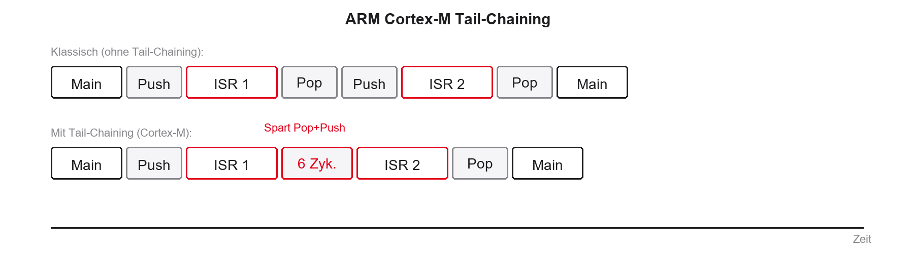

## Willkommen zu den Echtzeitsystemen!

- Herzlich willkommen im Kurs Echtzeitsysteme (EZS) an der DHBW Stuttgart
- Neun Termine: je 90 Minuten Theorie und 90 Minuten Praxis am Board
- Fokus: moderne Multicore-Architekturen in der Industrie
- Hardware: STM32H755 (Dual-Core Cortex-M7/M4)

::: notes
Herzlich willkommen zur Vorlesung Echtzeitsysteme. In den nächsten neun Terminen verbinden wir Theorie mit Praxis an Industrie-Hardware. Der STM32H755 dient als Dual-Core-Plattform für Echtzeit und Multicore-Synchronisation.
:::

## Agenda für heute

1. Organisatorisches und Spielregeln
2. Motivation und Definition von Echtzeit
3. Bare-Metal: Polling, Interrupts, Foreground/Background
4. Deep Dive: Cortex-M, NVIC und Tail-Chaining
5. Hardware STM32H755 und Toolchain
6. Laborübung am Board

::: notes
Zuerst Organisation und Prüfung, dann Motivation und präzise Definition. Anschließend Bare-Metal ohne RTOS, Grenzen von Polling und die Rolle von Interrupts — mit Vorbereitung auf die erste Laborübung.
:::

## Organisatorisches

- Prüfungsleistung: Details folgen (Klausur / Projekt — Angabe in Moodle)
- Materialien: Folien und Code auf der Kurswebsite und in Moodle
- Labor-Hardware: Boards werden gestellt (STM32H755)
- Tools: STM32CubeIDE (C/C++)
- Erwartung: aktive Mitarbeit im Labor — Programmieren lernt man durch Tippen

::: notes
Alle Folien und Übungsgerüste stehen online. Die Boards bekommen Sie gestellt. Echtzeitverhalten versteht man oft erst, wenn ein Timer-Interrupt nicht rechtzeitig feuert — deshalb Praxispflicht.
:::

## Literatur und Quellen

- Hermann Kopetz: *Real-Time Systems* (Design Principles)
- Giorgio C. Buttazzo: *Hard Real-Time Computing Systems* (Scheduling)
- STMicroelectronics: Reference Manual STM32H745/755 (RM0399)
- FreeRTOS Documentation (online)
- Tipp: Datenblätter und Reference Manuals sind Ihre wichtigste Alltagsquelle

::: notes
Kopetz und Buttazzo decken Theorie und Scheduling ab. Für die Praxis brauchen Sie ständig das RM0399 — nicht auswendig, aber navigierbar: Timer, Interrupt-Controller, Speicherarchitektur.
:::

## Motivation: Warum Echtzeit?

- Steigende Komplexität in Embedded Systems
- Autonomes Fahren, Medizintechnik, Industrie 4.0
- Ein normaler PC (Windows/Linux) gibt keine harten Garantien
- Timing-Fehler können katastrophale Folgen haben
- Ziel: Systeme, die vorhersagbar reagieren

::: notes
Wenn der Browser eine halbe Sekunde hängt, ist das ärgerlich. Wenn die Fräsmaschinensteuerung hängt, wird es gefährlich. Es geht nicht um „schnell“, sondern um garantierte, vorhersagbare Reaktionszeiten.
:::

## Der große Mythos der Echtzeit

:::: {.columns}
::: {.column width="48%"}
Was viele denken:

- „Echtzeit = extrem schnell“
- „4 GHz ist echtzeitfähiger als 400 MHz“
- „Echtzeit = flüssiges Video“
:::
::: {.column width="4%"}
:::
::: {.column width="48%"}
Was es wirklich ist:

- Echtzeit = Rechtzeitigkeit
- Ein 400-MHz-Controller mit Garantie kann echtzeitfähig sein
- Ein 4-GHz-PC ohne Garantie ist es oft nicht
:::
::::

::: notes
Echtzeit hat nichts mit maximalem Durchsatz zu tun. Ein kleiner Mikrocontroller mit fester 10-ms-Reaktion schlägt einen Server, der im Mittel 1 ms braucht, aber gelegentlich 50 ms blockiert.
:::

## Konsequenzen von Timing-Fehlern

- Ausfälle entstehen logisch oder zeitlich
- Beispiel Airbag:
  - Crash erkannt (logisch korrekt)
  - Zündung ausgelöst (logisch korrekt)
  - Zündung 50 ms zu spät (zeitlich falsch)
- Fazit: logisch richtig zur falschen Zeit ist ein Fehler

::: notes
Beim Airbag reicht korrekte Logik nicht. Zu späte Zündung ist nutzlos oder lebensgefährlich. In Echtzeitsystemen ist ein Ergebnis nach der Deadline ein falsches Ergebnis.
:::

## Lernziele des heutigen Tages

1. Klassische Echtzeit-Definition (Werte- und Zeitbereich) erklären
2. Harte, feste und weiche Echtzeit unterscheiden
3. Metriken Latenz und Jitter verstehen
4. Gefahren von Polling-Loops (Super-Loops) kennen
5. Einfache Hardware-Interrupts einordnen und konfigurieren

::: notes
Am Ende des Tages: Definition und Klassifikation, Latenz/Jitter, warum `while(1)`-Polling für komplexe Echtzeit ungeeignet ist, und wie Interrupts Determinismus zurückbringen.
:::

## Was ist Echtzeit? (Definition)

- Klassische Definition (häufig nach DIN 44300 zitiert, klassisch / historisch): Echtzeitbetrieb, wenn
  1. Ergebnisse logisch korrekt sind (Wertebereich)
  2. Ergebnisse innerhalb eines vorgegebenen Zeitintervalls vorliegen (Zeitbereich)
- Determinismus: zeitliches Verhalten in jedem Zustand vorhersagbar

::: notes
Zwei Dimensionen: Wertebereich und Zeitbereich. Die Formulierung geht auf die klassische / historische DIN-44300-Tradition zurück und wird in der Lehre weiterhin so zitiert. Beim Design streben wir Determinismus an — zeitliches Verhalten vorhersagen oder garantieren können.
:::

## Klassifizierung von Echtzeitsystemen

- Nicht jede Fristverletzung ist gleich dramatisch
- Unterscheidung nach Konsequenzen eines Deadline Miss:
  - Harte Echtzeit (Hard Real-Time)
  - Feste Echtzeit (Firm Real-Time)
  - Weiche Echtzeit (Soft Real-Time)
- Grenzen in der Praxis oft fließend und applikationsabhängig

::: notes
Je nach Kategorie wählen wir Architekturen und Betriebssysteme unterschiedlich. In einem Gerät können alle drei Kategorien auf verschiedene Tasks verteilt sein.
:::

## Harte Echtzeit (Hard Real-Time)

- Deadline-Überschreitung hat katastrophale Folgen
- Schäden an Mensch, Umwelt oder extrem hoher Verlust
- Nutzen nach der Deadline: abrupt null oder negativ
- Beispiele: Motorsteuerung, Fly-by-Wire, Herzschrittmacher

::: notes
Kein Spielraum: Fristverletzung = Systemversagen. Hier müssen wir die Worst-Case Execution Time (WCET) absichern — mathematisch oder durch extreme Tests.
:::

## Feste Echtzeit (Firm Real-Time)

- Zwischenstufe zwischen hard und soft
- Keine Katastrophe bei Fristverletzung
- Aber: Ergebnis nach der Deadline völlig wertlos (Nutzen = 0)
- Beispiele: High-Frequency Trading; Ausschuss-Erkennung am Band

::: notes
Späte Börsenorder: wertlos, System fällt nicht aus. Späte Qualitätsprüfung: Teil ist schon vorbei — Ergebnis verwerfen.
:::

## Weiche Echtzeit (Soft Real-Time)

- Deadline-Überschreitung mindert Qualität, führt aber nicht zum Ausfall
- Ergebnis behält nach der Deadline oft noch Restwert
- Beispiele: Video-Streaming, UI-Verzögerung, Raumtemperaturüberwachung
- Die meisten Standard-IT-Systeme fallen hier hinein

::: notes
Design oft auf den Average Case und hohen Durchsatz; gelegentliche Ausreißer werden toleriert. Video ruckelt — unschön, aber kein Crash.
:::

## Determinismus und WCET

- WCET: maximale, garantierte Ausführungszeit unter Worst-Case-Bedingungen
- BCET: minimale Ausführungszeit
- Harte Echtzeit immer auf Basis der WCET designen
- Caches, Pipeline-Stalls und Interrupts erschweren WCET bei modernen CPUs

::: notes
Durchschnittswerte reichen für harte Echtzeit nicht. Moderne Features (Caches, Branch Prediction) machen dieselbe Codezeile mal schnell, mal langsam — WCET wird zur Herausforderung.
:::

## Latenz (Reaktionsverzögerung)

- Latenz: Verzögerung zwischen Ereignis und Reaktion
- Interrupt-Latenz: Flanke am Pin bis erste Instruktion der ISR
- Response Time $R_i$ (Release → Completion): formal erst in VL2; nicht gleich Interrupt-Latenz

```{.wavedrom}
{
  "signal": [
    {"name": "Event (GPIO)", "wave": "0.1........", "node": "..a........"},
    {"name": "CPU", "wave": "2...3......", "data": ["Main", "ISR"], "node": "....b......"}
  ],
  "edge": ["a~>b Latenz"],
  "config": {"hscale": 2}
}
```

::: notes
Zwischen GPIO-Flanke und ISR: Interrupt erkennen, Pipeline leeren, Register sichern (Exception Entry / Stacking), Sprung in die ISR. Beim Cortex-M oft in der Größenordnung von ca. 12 Taktzyklen Hardware-Latenz — plus Software.
Die Response Time $R_i$ (Release → Completion) kommt formal erst in VL2 und ist etwas anderes als die Interrupt-Latenz hier.
:::

## Jitter

- Jitter: Varianz der Latenz oder der Periodizität
- Soll alle 10 ms laufen, Ist 9,8 ms / 10,2 ms → Peak-to-Peak-Jitter $=0{,}4\,\mathrm{ms}$
- Regelungstechnik: hoher Jitter verschlechtert PID-Qualität stark

```{.wavedrom}
{
  "signal": [
    {"name": "Ideal T", "wave": "l...H.l...H.l..."},
    {"name": "Ist", "wave": "l..H..l....H.l.."}
  ],
  "config": {"hscale": 2}
}
```

::: notes
Schwankendes `dt` zerstört Annahmen im Regler. Oft wichtiger als pure Geschwindigkeit: Jitter nahe null, Periodizität stabil.
:::

## Zusammenfassung: Metriken

- Deadline: Zeitpunkt, bis zu dem das Ergebnis vorliegen muss
- WCET: längste Abarbeitungsdauer des Codes
- Latenz: Startverzögerung bis zur Reaktion
- Jitter: Schwankungsbreite der zeitlichen Ausführung
- Goldene Regel: Vorhersagbarkeit (Determinismus), nicht Durchsatz

::: notes
Fragen zu diesem Theorieblock? Danach: wie man das klassisch programmiert.
:::

## Architekturen: Wie programmieren wir das?

- Wechsel von der Theorie zur Software-Architektur
- Ohne Betriebssystem: Bare-Metal
- Drei klassische Ansätze:
  1. Polling-Loops (Super-Loop)
  2. Interrupt-getriebene Systeme
  3. Foreground/Background-Systeme

::: notes
Code läuft direkt auf der Hardware. Die drei Muster sind historisch und didaktisch der Weg zum RTOS.
:::

## Architektur 1: Die Polling-Loop (Super-Loop)

- Simpelstes Muster: Endlosschleife `while(1)`
- Tasks strikt sequenziell
- Status wird aktiv abgefragt („Polling“)
- Vorteil: simpel, wenig Overhead, leicht zu debuggen

```{mermaid}
%%| fig-width: 3.5
%%{init: {'theme': 'base', 'themeVariables': {'background': '#FFFFFF', 'primaryColor': '#FFFFFF', 'primaryBorderColor': '#E5E5EA', 'primaryTextColor': '#1D1D1F', 'lineColor': '#86868B', 'secondaryColor': '#F5F5F7', 'tertiaryColor': '#FFFFFF', 'mainBkg': '#FFFFFF', 'nodeBorder': '#E5E5EA', 'clusterBkg': '#F5F5F7', 'clusterBorder': '#E5E5EA', 'titleColor': '#1D1D1F', 'edgeLabelBackground': '#FFFFFF'}}}%%
graph TD
  A[Init System] --> B{while 1}
  B --> C[Lese Sensor]
  C --> D[Verarbeite Daten]
  D --> E[Update Display]
  E --> B
  style B fill:#FFFFFF,stroke:#E2001A,stroke-width:2px !important
```

::: notes
Klassisches Arduino-Muster: linearer Kontrollfluss. Polling heißt: aktiv nachfragen, ob etwas passiert ist.
:::

## Code-Beispiel: Polling

```c
void main(void) {
    System_Init();
    while (1) {
        if (UART_Has_Data()) {   /* Polling */
            Process_Command();
        }
        if (Button_Pressed()) {  /* Polling */
            Toggle_LED();
        }
        Update_Display();
    }
}
```

- Der Code fragt den Status zyklisch ab
- Frage: Was passiert, wenn `Update_Display()` sehr lange dauert?

::: notes
Während einer langen Display-Funktion ist das System für Taster und UART blind. Latenz summiert sich über alle Tasks in der Schleife.
:::

## Die Gefahr: Das Heavy-Load-Problem

:::: {.columns}
::: {.column width="55%"}
- Eine lang laufende Funktion blockiert die gesamte Schleife
- Auf Eingänge kann nicht reagiert werden
- Latenzgarantien sind zerstört
- Typische Sünden: `delay(100)`, blockierende Warteschleifen
:::
::: {.column width="45%"}
```c
void Update_Display(void) {
    /* ~50 ms Ausführungszeit */
    Draw_Pixels();
}
```

Worst-Case-Latenz für den Taster: $>50\,\mathrm{ms}$
:::
::::

::: notes
Eine 50-ms-Funktion lässt die Super-Loop stehen. Kurze Tasterimpulse gehen verloren. So darf man in der Industrie nicht programmieren.
:::

## Fazit: Polling

- Vorteile: simpel, keine Race Conditions, feste Reihenfolge
- Nachteile: hoher Stromverbrauch, keine Priorisierung, hohe Latenzen
- Einsatz: nur extrem simple Single-Purpose-Geräte

::: notes
Für einen dummen Temperatursensor oft ok. Sobald mehrere asynchrone Ereignisse mit unterschiedlicher Dringlichkeit kommen, scheitert das Modell.
:::

## Architektur 2: Interrupts zur Rettung

- Interrupt: Hardware-Signal, das die CPU unterbricht
- Kontext sichern, Sprung in die ISR
- Nicht mehr fragen — die Hardware meldet sich
- Ereignisse priorisierbar (z. B. Not-Halt vor Display)

::: notes
Asynchrone Reaktion mit geringer Latenz, unabhängig von der Main-Loop. Das ist der Schlüssel gegen das Heavy-Load-Problem.
:::

## Der Ablauf eines Interrupts

```{mermaid}
%%| fig-width: 5.2
%%{init: {'theme': 'base', 'themeVariables': {'background': '#FFFFFF', 'primaryColor': '#FFFFFF', 'primaryBorderColor': '#E5E5EA', 'primaryTextColor': '#1D1D1F', 'lineColor': '#86868B', 'secondaryColor': '#F5F5F7', 'tertiaryColor': '#FFFFFF', 'mainBkg': '#FFFFFF', 'nodeBorder': '#E5E5EA', 'clusterBkg': '#F5F5F7', 'clusterBorder': '#E5E5EA', 'titleColor': '#1D1D1F', 'edgeLabelBackground': '#FFFFFF'}}}%%
sequenceDiagram
  participant HW as Hardware
  participant CPU as CPU Main Loop
  participant ISR as ISR
  CPU->>CPU: Code ausführen (z. B. Display)
  HW-->>CPU: Interrupt Request IRQ
  Note over CPU: Context Switch
  CPU->>ISR: Sprung zur ISR
  Note over ISR: zeitkritische Arbeit
  ISR-->>CPU: Return from Interrupt
  Note over CPU: Register wiederherstellen
  CPU->>CPU: alten Code fortsetzen
```

::: notes
Context Switch sichert Register und Program Counter. Danach ISR, dann Rückkehr genau an die Unterbrechungsstelle.
:::

## Code-Beispiel: Timer-Interrupt (STM32 HAL)

:::: {.columns}
::: {.column width="50%"}
Setup in `main()`:

```c
HAL_TIM_Base_Start_IT(&htim2);

while (1) {
    Update_Display(); /* Hintergrund */
}
```
:::
::: {.column width="50%"}
Callback (ISR):

```c
void HAL_TIM_PeriodElapsedCallback(
    TIM_HandleTypeDef *htim)
{
    if (htim->Instance == TIM2) {
        Toggle_LED(); /* zeitkritisch */
    }
}
```
:::
::::

::: notes
`_IT` startet den Timer im Interrupt-Modus. Die LED blinkt deterministisch, auch wenn `Update_Display()` lange braucht.
:::

## Gefahren von Interrupts

- Race Conditions bei gemeinsamen globalen Variablen
- Lange ISRs blockieren niederpriore IRQs und die Main-Loop
- Goldene Regel: ISRs extrem kurz halten — kein `printf`, keine Delays
- Jitter: laufende höhere IRQs verzögern niederpriore ISRs

::: notes
Asynchronität bringt Korrektheitsfallen. In der ISR: Flag setzen, Wert kopieren, sofort zurück. Lange Arbeit gehört in den Hintergrund oder später in Tasks.
:::

## Architektur 3: Foreground / Background

- Kombination: Main-Loop + Interrupts
- Background: unkritische Polling-Loop (`main`)
- Foreground: zeitkritische ISRs
- Standard für kleine bis mittlere Bare-Metal-Projekte

```{.plantuml}
@startuml
skinparam backgroundColor transparent
skinparam defaultFontName "Inter, sans-serif"
skinparam defaultFontColor #1D1D1F
skinparam ArrowColor #86868B
skinparam NoteBackgroundColor #F5F5F7
skinparam NoteBorderColor #E5E5EA
skinparam timing {
  BackgroundColor #FFFFFF
  BorderColor #E5E5EA
  LineColor #1D1D1F
  SignalColor #E2001A
}

robust "Foreground (ISR)" as ISR
robust "Background (Main)" as Main

@0
Main is Running
ISR is Idle

@2
ISR is Running
Main is Preempted

@4
ISR is Idle
Main is Running
@enduml
```

::: notes
ISR präemptiert die Main-Loop. Fertig → Main läuft weiter. Das ist das klassische Bare-Metal-Muster vor dem RTOS.
:::

## Grenzen der klassischen Architekturen

- Warum reicht Foreground/Background oft nicht mehr?
- Spaghetti-Falle: ISRs setzen Flags, Main pollt endlos
- Bei vielen Tasks verliert man den Überblick über den Kontrollfluss
- Wir brauchen Priorisierung und Schlafen von Tasks

::: notes
ISR darf nicht lange rechnen → Flag. Main wird Flag-Suppe. Deadlines in der Main-Loop sind dann kaum noch garantierbar.
:::

## Der Paradigmenwechsel

- Wenn Bare-Metal nicht skaliert: RTOS (Real-Time Operating System)
- Bare-Metal: Code pollt oder wartet aktiv
- RTOS: Kontrolle über die Zeit an den Scheduler
- Monolith → unabhängige Tasks

::: notes
Ab hier ändert sich die Denkweise: nicht mehr eine riesige `while(1)` orchestrieren, sondern Tasks und Scheduler. FreeRTOS folgt in späteren Terminen.
:::

## Vorschau: Das Task-Modell

```{.plantuml}
@startuml
skinparam backgroundColor transparent
skinparam defaultFontName "Inter, sans-serif"
skinparam defaultFontColor #1D1D1F
skinparam ArrowColor #86868B
skinparam NoteBackgroundColor #F5F5F7
skinparam NoteBorderColor #E5E5EA
skinparam timing {
  BackgroundColor #FFFFFF
  BorderColor #E5E5EA
  LineColor #1D1D1F
  SignalColor #E2001A
}

robust "Task A (High Prio)" as TA
robust "Task B (Low Prio)" as TB

@0
TA is Blocked
TB is Running

@2
TA is Ready
TA is Running
TB is Ready

@5
TA is Blocked
TB is Running
@enduml
```

- Task B rechnet; Event weckt Task A
- RTOS entzieht Task B die CPU (Präemption) und gibt sie Task A

::: notes
Echtes präemptives Multitasking auf einem Core. Details zu Scheduler-Latenzen und Synchronisation: spätere Vorlesungen mit FreeRTOS.
:::

## Deep Dive: Die ARM Cortex-M Architektur

- Um Interrupts zu beherrschen, müssen wir die CPU verstehen
- Der STM32H755 basiert auf ARM Cortex-M (M7 und M4)
- Cortex-M ist für eingebettete Echtzeitsysteme optimiert
- Merkmale:
  - 32-Bit-Architektur (Register, Busse, ALU)
  - Deterministisches Interrupt-Verhalten
  - Keine MMU (virtuelle Adressen), sondern MPU (Memory Protection Unit)

::: notes
Cortex-M („Microcontroller“) ist auf Determinismus ausgelegt — anders als Cortex-A mit MMU. Physische Adressierung und enge Anbindung des Interrupt-Controllers halten Latenzen vorhersagbar.
:::

## Das Register-Set der CPU

| Register | Rolle |
|----------|-------|
| R0–R12 | Allgemeine Datenregister |
| R13 (SP) | Stack Pointer |
| R14 (LR) | Link Register (Rücksprungadresse) |
| R15 (PC) | Program Counter |
| xPSR | Statusregister (Flags) |

- 16 Basis-Register à 32 Bit
- Bei Interrupt: Kontext dieser Register sichern (Hardware-Push)

::: notes
Bei einem Interrupt sind diese Register voll mit dem Zustand der Main-Loop. Die ISR nutzt dieselben Register — deshalb muss der Kontext gesichert werden. R13 (SP) ist für den Context Switch besonders zentral.
:::

## Was passiert beim Context Switch?

- Interrupt unterbricht die Main-Loop
- CPU muss den Zustand retten, um später fortzusetzen
- Ablauf (hardwaregesteuert):
  1. Pipeline Flush, Abarbeitung stoppt
  2. Automatischer Push: R0–R3, R12, LR, PC, xPSR auf den Stack
  3. PC auf Startadresse der ISR setzen
  4. ISR ausführen
  5. Pop: Register vom Stack wiederherstellen

::: notes
Der Cortex-M pusht die wichtigsten Register automatisch. Danach erst der Sprung in die C-ISR. Nach dem Rücksprung merkt die Main-Loop die Unterbrechung nicht — sofern die ISR den Stack korrekt hinterlässt.
:::

## Der NVIC: Herr der Interrupts

- NVIC = Nested Vectored Interrupt Controller
- Sitzt im Cortex-M-Kern, eng mit der CPU verzahnt
- Verwaltet viele Interrupt-Quellen (beim STM32 bis zu 240)
- Vectored: jeder Interrupt hat einen Eintrag in der Vector Table
- Hardware springt direkt zur ISR — kein Software-Switch-Case

::: notes
„Vectored“ spart Latenz: kein allgemeiner Handler mit IF-Kaskade, sondern direkter Sprung über die Vektortabelle.
:::

## Prioritäten im NVIC

- Nested: ein wichtiger Interrupt darf einen unwichtigeren unterbrechen
- Prioritäten als Nummern (z. B. 4 Bit → 0 bis 15)
- Falle: je kleiner die Zahl, desto höher die Priorität
- Priorität 0: höchste Priorität
- Priorität 15: niedrigste Priorität

::: notes
Lowest number = highest priority. Not-Halt mit Prio 0 muss eine laufende UART-ISR unterbrechen können.
:::

## Preemption Priority vs. Subpriority

- Prioritäts-Bits lassen sich aufteilen (Grouping)
- Preemption Priority: darf ein IRQ einen laufenden IRQ unterbrechen?
- Subpriority: bei gleichzeitigem Auftreten — wer zuerst?
- Höhere Subpriority unterbricht niemals einen bereits laufenden Interrupt

::: notes
Subpriority entscheidet nur die Warteschlange, nicht die Präemption. In FreeRTOS konfigurieren wir das Grouping typischerweise so, dass wir reine Preemption Priorities nutzen.
:::

## Prioritätsinversion (Teaser)

- Low hält Ressource, High muss warten, Medium präemptiert Low
- Ergebnis: Medium blockiert indirekt High (Priority Inversion)
- Vollständige Behandlung (inkl. Priority Inheritance): VL4

```{.plantuml}
@startuml
skinparam backgroundColor transparent
skinparam defaultFontName "Inter, sans-serif"
skinparam defaultFontColor #1D1D1F
skinparam ArrowColor #86868B
skinparam NoteBackgroundColor #F5F5F7
skinparam NoteBorderColor #E5E5EA
skinparam timing {
  BackgroundColor #FFFFFF
  BorderColor #E5E5EA
  LineColor #1D1D1F
  SignalColor #E2001A
}

robust "High" as H
robust "Medium" as M
robust "Low" as L

@0
L is Running
H is Blocked
M is Idle

@2
M is Running
L is Ready
H is Blocked

@5
L is Running
M is Idle
H is Blocked

@7
H is Running
L is Idle
M is Idle
@enduml
```

- Teaser: Mars Pathfinder (1997) — Details und Abhilfe in VL4

::: notes
Low hält die Ressource, High wartet, Medium präemptiert Low — High bleibt blockiert. Das Muster brachte 1997 den Mars Pathfinder in Schwierigkeiten. Vollständige Behandlung (Priority Inheritance Protocol u. a.) folgt in VL4.
:::

## Tail-Chaining: ARMs Geheimwaffe

- Zwei Interrupts A und B treten kurz nacheinander auf
- Klassisch: Push → ISR A → Pop → Push → ISR B → Pop
- Tail-Chaining: Cortex-M überspringt sinnloses Pop/Push zwischen ISRs
- Dauer: typisch 6 Taktzyklen statt ca. 24 Zyklen Latenz

{.nostretch}

::: notes
Wenn nach ISR 1 noch IRQ 2 ansteht, entfällt das teure Pop+Push. Der NVIC kettet die Handler an — Determinismus und Latenzgewinn in Hardware.
:::

## Exkurs Hardware: Der STM32H755

- Dual-Core-Mikrocontroller, Asymmetric Multiprocessing (AMP)
- Cortex-M7 (bis 480 MHz): hohe Leistung, Caches, FPU
- Cortex-M4 (bis 240 MHz): harte Echtzeit, hochdeterministisch
- Beide Cores teilen Chip, Busse und teilweise Speicher

::: notes
Anders als SMP beim PC: zwei ungleiche Kerne im selben Gehäuse. M7 für Durchsatz, M4 für deterministische Steuerung.
:::

## Warum Dual-Core (AMP) in der Echtzeit?

:::: {.columns}
::: {.column width="48%"}
Cortex-M7 (eher soft):

- Ethernet-Stack (TCP/IP)
- GUI
- aufwändige Filter (DSP)
- Latenz schwankend (Caches)
:::
::: {.column width="4%"}
:::
::: {.column width="48%"}
Cortex-M4 (eher hard):

- Motorsteuerung (PWM)
- harte Timing-Loops
- sicherheitskritische Logik
- Latenz hochdeterministisch
:::
::::

- Inter-Core-Kommunikation: Shared Memory im SRAM

::: notes
Display/Netzwerk und Motorregelung auf einem Kern stören sich gegenseitig. Cache-Misses erzeugen Jitter. AMP trennt die Welten physisch.
:::

## Boot-Sequenz des STM32H755

- Beim Reset starten nicht beide Cores gleichzeitig
- Cortex-M7 bootet als Master
- Cortex-M4 bleibt zunächst im Reset/Sleep
- M7 konfiguriert Systemtakt (PLL), dann weckt M4 (HSEM/RCC)

```{mermaid}
%%| fig-width: 5.2
%%{init: {'theme': 'base', 'themeVariables': {'background': '#FFFFFF', 'primaryColor': '#FFFFFF', 'primaryBorderColor': '#E5E5EA', 'primaryTextColor': '#1D1D1F', 'lineColor': '#86868B', 'secondaryColor': '#F5F5F7', 'tertiaryColor': '#FFFFFF', 'mainBkg': '#FFFFFF', 'nodeBorder': '#E5E5EA', 'clusterBkg': '#F5F5F7', 'clusterBorder': '#E5E5EA', 'titleColor': '#1D1D1F', 'edgeLabelBackground': '#FFFFFF'}}}%%
sequenceDiagram
  participant Reset as Reset Hardware
  participant M7 as Cortex-M7
  participant M4 as Cortex-M4
  Reset->>M7: Boot Power-On
  Reset->>M4: Held in Reset
  Note over M7: System Clock PLL
  M7->>M7: Init HAL und Peripherie
  M7->>M4: Wakeup RCC/HSEM
  Note over M4: unabhängiger Boot
  M4->>M4: Init lokale Peripherie
```

::: notes
Beide würden sonst gleichzeitig den Takt konfigurieren. Für Hello World wecken wir den M4 und nutzen ihn als Arbeitskern.
:::

## Einführung in die Tools: STM32CubeIDE

- STM32CubeIDE: Eclipse-basierte C/C++-IDE für STM32
- Device Configuration Tool (ehemals CubeMX)
- Grafische Pin-Zuweisung und Clock-Tree
- Codegenerator für die HAL

::: notes
Statt hundert Seiten Register-Doku: Pin wählen, Funktion zuweisen, Takt konfigurieren — der Generator liefert die Basis-Initialisierung.
:::

## Das HAL-Konzept

:::: {.columns}
::: {.column width="55%"}
- Nicht direkt in Register tippen (Standardfall)
- HAL: lesbar und oft portabel innerhalb der STM32-Familie
- Nachteil: leichter Aufruf-Overhead
- Extreme Echtzeit: LL oder direkte Register
:::
::: {.column width="45%"}
```c
/* HAL (Standard) */
HAL_TIM_Base_Start_IT(&htim2);

/* LL (schneller) */
LL_TIM_EnableIT_UPDATE(TIM2);
LL_TIM_EnableCounter(TIM2);

/* Register */
TIM2->DIER |= (1u << 0);
TIM2->CR1  |= (1u << 0);
```
:::
::::

::: notes
Für den Großteil der Vorlesung reicht HAL. Wenn jede Nanosekunde zählt, wechseln wir gezielt auf LL oder Registerzugriff.
:::

## Projektstruktur und Code-Generierung

- Pro Core eigener Ordner (CM4 / CM7)
- Je eigene `main.c` und `stm32h7xx_it.c`
- Eigener Code nur zwischen `USER CODE BEGIN` und `USER CODE END`
- Code außerhalb dieser Blöcke wird beim erneuten Generieren gelöscht

::: notes
Die wichtigste Anfängerregel: nur in USER-CODE-Blöcken schreiben — sonst ist die Arbeit mit einem Speichern in der GUI weg.
:::

## Laboraufgabe 1: Hello World (LED Blink)

- Ziel: Toolchain prüfen, Cortex-M4 nutzen
- Schritte:
  1. Projekt anlegen (Board STM32H755ZI-Q)
  2. LED (z. B. PE1) als `GPIO_Output` für CM4
  3. Code generieren
  4. In `main.c` (CM4) toggeln

```c
/* USER CODE BEGIN 3 */
while (1) {
    HAL_GPIO_TogglePin(GPIOE, GPIO_PIN_1);
    HAL_Delay(500); /* blockiert 500 ms */
}
/* USER CODE END 3 */
```

::: notes
Wenn die LED blinkt, laufen IDE, Flash und Debugger. Das Delay ist bewusst blockierend — als Kontrast zu Aufgabe 3.
:::

## Laboraufgabe 2: Das Polling-Desaster

- Ziel: Grenzen der Super-Loop spüren
- `Heavy_Load()` vor dem Toggle aufrufen (simuliert Filter/Display)

```c
while (1) {
    Heavy_Load(800000); /* CPU-Last */
    HAL_GPIO_TogglePin(GPIOE, GPIO_PIN_1);
    HAL_Delay(500);
}
```

- Beobachtung: Warum ist der 500-ms-Takt zerstört?

::: notes
Die unbekannte Laufzeit von `Heavy_Load()` addiert sich zum Delay. Latenz und Periodizität werden unvorhersagbar — genau das Heavy-Load-Problem aus der Theorie.
:::

## Laboraufgabe 3: Rettung durch den Timer

- Ziel: Determinismus per Interrupt wiederherstellen
- In der `.ioc`: TIM2 aktivieren, Clock Source Internal
- NVIC: „TIM2 global interrupt“ aktivieren
- Timer im Interrupt-Modus starten
- Periodizität berechnen, z. B. 500 ms (2 Hz):

$$f_{\mathrm{UPD}} = \frac{f_{\mathrm{CLK}}}{(PSC+1)\,(ARR+1)}$$

::: notes
Ohne NVIC-Haken feuert die Hardware den IRQ nicht zur CPU. PSC und ARR aus dem tatsächlichen Timer-Takt ableiten.
:::

## Laboraufgabe 3: Der Callback-Code

- Toggle und Delay aus der `while(1)` entfernen — dort nur noch `Heavy_Load()`
- Callback ans Ende von `main.c`:

```c
/* USER CODE BEGIN 4 */
void HAL_TIM_PeriodElapsedCallback(TIM_HandleTypeDef *htim) {
    if (htim->Instance == TIM2) {
        HAL_GPIO_TogglePin(GPIOE, GPIO_PIN_1);
    }
}
/* USER CODE END 4 */
```

- Ergebnis: LED blinkt präzise, unabhängig von der CPU-Last

::: notes
Foreground/Background: ISR toggelt die LED, Main rechnet Heavy Load. Präzises Blinken trotz Last.
:::

## Laboraufgabe 4 (Bonus): Messung am Oszi

- Ziel: Jitter Main-Loop vs. Timer-ISR messen
- Freien GPIO (z. B. PA0) als Output nutzen
- Ablauf: Pin High → `Heavy_Load()` → Pin Low; Pulsweite am Oszi
- Vergleich: Pin-Toggle in der ISR (Jitter $\approx 0$)

::: notes
In der Industrie glauben wir Timing nicht, wir messen es. WCET der Berechnung vs. fast jitterfreie ISR-Flanke.
:::

## Zusammenfassung des Tages

- Echtzeit = Rechtzeitigkeit, nicht pure Rechenleistung
- Super-Loops skalieren schlecht (Latenz-Akkumulation)
- Interrupts ermöglichen Hardware-Präemption (Foreground/Background)
- NVIC: Prioritäten hardwarenah, inkl. Tail-Chaining
- Workflow: Bare-Metal-Code auf Cortex-M4 generieren und erweitern

::: notes
Determinismus und Deadlines stehen im Zentrum. Interrupts retten Latenz — mit neuen Gefahren (Race Conditions, lange ISRs). Hardware-Features wie Tail-Chaining senken Overhead.
:::

## Ausblick auf Termin 2

- Bare-Metal mit vielen IRQs skaliert nicht ewig (Spaghetti-Flags)
- Nächste Woche: Scheduling-Theorie
- Praxis: eigener einfacher Round-Robin-Scheduler auf dem STM32
- Vorbereitung: heutiges Projekt mitbringen

::: notes
Danach der Weg zu FreeRTOS. Bitte Projekte speichern — wir bauen darauf auf. Fragen? Dann weiter im Labor.
:::
