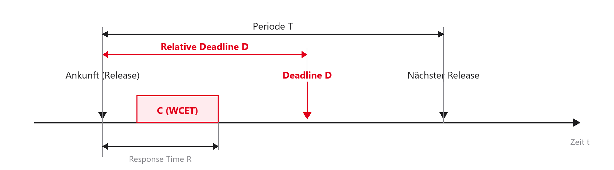

## Willkommen zurück zu Echtzeitsystemen!

- Herzlich willkommen zum 2. Termin unserer Vorlesung
- Letzte Woche: Hardware, Cortex-M4, Interrupts und Bare-Metal
- Heute: von der Hardware-Ebene zu Informatik und Mathematik
- Fokus: Wie verteile ich CPU-Zeit gerecht und vorhersagbar?
- Praxis am Nachmittag: eigener kleiner Scheduler

::: notes
Willkommen zurück. Letzte Woche: STM32, Polling-Gefahren und Interrupts. Heute: Schedulability-Theorie — wir wollen nicht hoffen, dass Tasks rechtzeitig fertig werden, sondern das mathematisch absichern. Am Nachmittag bauen Sie Ihren ersten Scheduler für den Cortex-M4.
:::

## Agenda für heute

1. Recap: Warum Bare-Metal nicht skaliert
2. Task-Modelle: Software mathematisch beschreiben
3. Metriken: WCET und CPU-Auslastung ($U$)
4. Scheduling-Verfahren: kooperativ bis präemptiv
5. RMS, Utilization Bound, RTA und EDF
6. SysTick/PendSV und Labor: Round-Robin

::: notes
Kurz zurückblicken, dann formales Task-Modell mit Ausführungszeit und Periode. Danach Auslastung $U$, Strategien des Schedulers, RMS/EDF, Cortex-M-Scheduler-Mechanik und kooperatives Round-Robin im Labor.
:::


## Lernziele des heutigen Tages

1. Task-Modell ($C_i$, $T_i$, $D_i$) aufstellen und skizzieren
2. WCET und CPU-Auslastung ($U$) verstehen und berechnen
3. Kooperatives und präemptives Scheduling unterscheiden
4. Rate Monotonic Scheduling (RMS) einordnen und Grenzen kennen
5. Round-Robin-Scheduler als Laborziel verstehen

::: notes
Am Ende: Task-Set formalisieren, $U$ berechnen, RMS als Industrieprinzip kennen und Round-Robin im Labor umsetzen können.
:::

## Recap: Polling vs. Interrupts

:::: {.columns}
::: {.column width="50%"}
- Polling (Super-Loop):
  - Einfach, linear, wenige Race Conditions
  - Problem: Latenzen addieren sich; lange Funktionen blockieren alles
- Interrupts (Vordergrund/Hintergrund):
  - Hardware erzwingt Kontextwechsel (Präemption)
  - Problem: ISRs müssen extrem kurz sein
:::
::: {.column width="50%"}
```c
/* Das Heavy-Load-Problem */
while (1) {
    Sensor_Auswerten(); /* z. B. 50 ms */
    LED_Blinken();      /* stottert */
}
```
:::
::::

::: notes
Die `while(1)`-Schleife reicht für einfache Fälle. Sobald Filter oder schwere Berechnung hinzukommen, wird das System blind. Interrupts retten die Latenz — aber lange ISRs blockieren Timer und andere IRQs.
:::

## Recap: Die Spaghetti-Code-Falle

- System wächst: Sensoren, Displays, USB, Ethernet, Motorregelung
- Nicht alles darf in Interrupts (nur die kürzesten Routinen)
- Folge in Bare-Metal:
  - ISRs setzen unzählige Flags (`if (usb_ready_flag) …`)
  - Main-Loop wird unübersichtlich
  - Prioritäten und Deadlines sind kaum noch berechenbar

::: notes
Große Bare-Metal-Projekte landen oft in der Flag-Suppe: ISR setzt `usb_daten_da = 1`, Main pollt hunderte Flags. Wer darf zuerst rechnen — Motor oder USB? Determinismus und Deadlines gehen verloren.
:::

## Der Paradigmenwechsel: Das Betriebssystem

- Lösung: Zeitmanagement an ein RTOS delegieren
- Statt einer riesigen `while(1)`: viele kleine, getrennte Endlosschleifen
- Jede Schleife heißt Task (oder Thread)
- Der Scheduler entscheidet, wann welche Task laufen darf

::: notes
Architekturwechsel: Display und Motor werden eigene Endlosschleifen — Tasks. Zwischen ihnen sitzt der Scheduler und orchestriert die CPU-Zeit.
:::

## Was ist Scheduling?

- Scheduling (Ablaufplanung): zeitliche Anordnung von Aufgaben
- Ressource: CPU-Rechenzeit
- Kriterien:
  - Fairness: jede Task bekommt irgendwann Zeit (Starvation vermeiden)
  - Echtzeit (Spezialfall): Fairness oft egal — Deadlines haben Vorrang

::: notes
Windows/Linux optimieren oft auf Fairness. Harte Echtzeit: die sicherheitskritische Motor-Task hält ihre Deadline, auch wenn das Display einfriert.
:::

## Vom C-Code zum Modell

- Mathematische Garantien brauchen Abstraktion
- Der Scheduler sieht nicht „Motor“ oder „LED“, sondern Parameter
- Typisch: Ausführungszeit, Periode, Deadline
- Formalisierung: das Task-Modell

::: notes
Dem Scheduler ist die Semantik des C-Codes egal. Er braucht Zahlen: Wie lange maximal? Wie oft? Welche Frist? Daraus entsteht der Fahrplan.
:::

## Definition: Was ist eine Task?

- Eine Task $\tau_i$ ist die kleinste Ausführungseinheit in einem RTOS
- Jede Task besitzt:
  - eigenen Kontext (Register, Stack)
  - meist eine endlose `while(1)`-Schleife
- Illusion: jede Task „glaubt“, die CPU allein zu haben
- Job: eine konkrete Ausführung (ein Schleifendurchlauf)

::: notes
Task = Struktur/Programm; Job = ein konkreter Durchlauf. Schnelle Kontextwechsel erzeugen die Illusion exklusiver CPU-Nutzung.
:::

## Parameter einer Task: $C_i$ (Ausführungszeit)

- $C_i$ (Computation Time / Capacity): Rechenzeit ohne Unterbrechung
- In harten Echtzeitsystemen: $C_i$ = WCET (Worst-Case Execution Time)
- Ohne bekannte WCET keine mathematische Garantie

::: notes
Durchschnitte reichen nicht. Wenn die Task im Schnitt 2 ms braucht, im Worst Case 5 ms, plant der Scheduler mit 5 ms — sonst ist jeder Beweis hinfällig.
:::

## Parameter einer Task: $T_i$ (Periode)

- $T_i$ (Period): Abstand zwischen zwei Releases der Task
- Beispiel: Temperatursensor 10-mal/s $\rightarrow T_i = 100\,\mathrm{ms}$
- In der Theorie oft strikt periodische Tasks

::: notes
Viele Steuergeräte sind periodisch: Regler alle 10 ms. $T_i$ ist der Abstand zwischen den Momenten, in denen die Task ready wird.
:::

## Parameter einer Task: $D_i$ (Deadline)

- $D_i$ (Deadline): maximale Zeit nach dem Release bis zum fertigen Ergebnis
- $R_i$ (Response Time): tatsächliche Antwortzeit inkl. Unterbrechungen
- Goldene Regel der Echtzeit — schedulbar nur wenn:

$$R_i \le D_i$$

::: notes
$R_i$ ist oft größer als $C_i$, weil höherpriore Tasks und Interrupts unterbrechen. Trotzdem muss $R_i \le D_i$ in jedem Szenario gelten.
:::

## Das grafische Task-Modell

- Alle Parameter an einem Job auf dem Zeitstrahl
- Release, Ausführung $C$, Response Time $R$, Deadline $D$, Periode $T$

{.nostretch}

::: notes
Pfeil nach oben: Release. Rotes Feld: $C$ (WCET). Distanz Release bis Ende der Ausführung: $R$. Roter Abwärtspfeil: Deadline. Abstand zum nächsten Release: Periode $T$.
:::

## Deadline-Klassifizierung

:::: {.columns}
::: {.column width="60%"}
Verhältnis von Deadline zu Periode:

- Implicit Deadline: $D_i = T_i$
- Constrained Deadline: $D_i \le T_i$
- Arbitrary Deadline: $D_i$ beliebig
:::
::: {.column width="40%"}
Für die meisten RMS-Rechnungen: Implicit Deadlines — Standard in Steuergeräten.
:::
::::

::: notes
Implicit: fertig vor dem nächsten eigenen Job. Constrained: Frist kürzer als Periode. Viele Formeln heute setzen Implicit Deadlines voraus.
:::

## Task-Typen nach Auslöser

- Periodisch: feste Periode $T_i$, typisch Timer/Regler
- Sporadisch: zufälliger Auslöser, aber garantierte Mindestzeit (Minimum Inter-Arrival Time) — wie periodisch mit $T_{\min}$
- Aperiodisch: kein Minimum (z. B. Netzwerk-Ping) — harte Garantien unmöglich

::: notes
Ein Taster ist sporadisch: physisch begrenzte Rate. Netzwerk-Broadcasts können aperiodisch sein — ohne Minimum keine harte Echtzeitgarantie.
:::

## Das RTOS Task-Zustandsmodell

- Running: besitzt die CPU (Single-Core: genau eine Task)
- Ready: will rechnen, wartet in der Warteschlange
- Blocked / Waiting: wartet auf Ereignis (Delay, Semaphore, UART) — belastet die CPU nicht

::: notes
Blocked ist der Schlüssel: kein aktives Polling. Die Task kostet 0 % CPU, bis ein Interrupt sie wieder ready macht.
:::

## Visualisierung der Zustandsmaschine {.scrollable}

```{.plantuml}
@startuml
skinparam backgroundColor transparent
skinparam defaultFontName "Inter, sans-serif"
skinparam defaultFontColor #1D1D1F
skinparam ArrowColor #86868B
skinparam NoteBackgroundColor #F5F5F7
skinparam NoteBorderColor #E5E5EA
skinparam StateBackgroundColor #FFFFFF
skinparam StateBorderColor #E5E5EA
skinparam StateFontColor #1D1D1F

[*] --> Ready : Create Task
Ready --> Running : Dispatch
Running --> Ready : Preempt
Running --> Blocked : Wait / Delay
Blocked --> Ready : Event (z. B. IRQ)
Running --> [*] : Task Deleted

note right of Blocked
  belastet die CPU nicht
end note
@enduml
```

- Blocked wird nie direkt Running — immer zuerst Ready-Queue

::: notes
Dispatch wählt die höchstpriore Ready-Task. Präemption wirft die laufende Task zurück nach Ready. Events wecken nur in die Ready-Queue; der Scheduler entscheidet über Running.
:::

## Metrik: CPU-Auslastung ($U$)

- Utilization $U$: Indikator, ob ein System überhaupt lösbar ist
- Anteil einer Task: $U_i = \frac{C_i}{T_i}$
- Beispiel: $C=2\,\mathrm{ms}$, $T=10\,\mathrm{ms}$ $\rightarrow U_i = 0{,}2$ (20 %)
- Systemauslastung:

$$U = \sum_{i=1}^{n} \frac{C_i}{T_i}$$

::: notes
$U$ ist das Fundament jeder Schedulability-Analyse. Zuerst Teilauslastungen, dann Summe über alle Tasks.
:::

## Auslastung: Ein Rechenbeispiel

- System mit drei Tasks:
  - $\tau_1$: $C_1=1$, $T_1=4$ $\rightarrow U_1=25\%$
  - $\tau_2$: $C_2=2$, $T_2=5$ $\rightarrow U_2=40\%$
  - $\tau_3$: $C_3=2$, $T_3=10$ $\rightarrow U_3=20\%$
- Gesamt: $U = 85\%$
- Erste Regel: $U > 1$ (100 %) → unmöglich schedulbar
- Bei 85 %: hängt vom Algorithmus ab!

::: notes
Über 100 % hilft kein Algorithmus — physikalische Überlast. Unter 100 % ist Schedulability algorithmusabhängig; das ist der Kern der zweiten Vorlesungshälfte.
:::

## Exkurs: Das Problem mit der WCET

- Warum WCET statt ACET (Average)?

```c
if (sensor_value > 1000) {
    calculate_fft(); /* ~10 ms (Worst Case) */
} else {
    flag = 1;        /* ~0.1 ms (Best Case) */
}
```

- ACET vielleicht 1 ms — Auslegung auf 1 ms crasht, wenn der Worst Case eintritt

::: notes
Harte Echtzeit plant immer mit WCET, auch wenn der Fall selten ist. Ein heißer Tag und die FFT reißt sonst alle Deadlines.
:::

## Wie ermittelt man die WCET?

:::: {.columns}
::: {.column width="50%"}
1. Analytisch (statisch)
   - Code ohne Laufzeit mathematisch analysieren
   - Absolute Obergrenze
   - Schwer bei Caches (z. B. Cortex-M7)
:::
::: {.column width="50%"}
2. Empirisch (Messung)
   - Stresstests, Oszi, Trace-Tools
   - Nahe an der Realität
   - Keine absolute Garantie — oft mit Puffer
:::
::::

::: notes
Analytisch: sichere Schranke, aber schwer bei modernen CPUs. Praxis oft messen, Worst Case nehmen und Sicherheitspuffer aufschlagen.
:::

## Zusammenfassung Task-Modell

- Tasks: getrennte Endlosschleifen
- OS orchestriert Ready / Running / Blocked
- Parameter: $C_i$ (WCET), $T_i$ (Periode), $D_i$ (Deadline)
- CPU-Auslastung $U$ muss $\le 100\%$ sein

::: notes
Fragen zum Task-Modell? Als Nächstes: nach welchen Regeln der Scheduler die Ready-Queue auflöst.
:::

## Die Kernfrage des Schedulings

- Mehrere Tasks im Zustand Ready
- Nur ein Core: wer darf rechnen?
- Genau das entscheidet der Scheduling-Algorithmus
- Die Wahl entscheidet über Echtzeit oder Deadline-Miss

::: notes
Timer-Tick: Motor, Display und Netzwerk sind ready. Der Algorithmus vergibt den einzigen Kern — und damit Erfolg oder Crash.
:::

## Scheduler vs. Dispatcher

- Scheduler (Entscheider):
  - Algorithmus: wer hat Vorrang?
  - aktualisiert Task-Control-Blöcke (TCB)
- Dispatcher (Ausführer):
  - Context Switch (Register sichern/laden)
  - Stack-Pointer der gewählten Task setzen

::: notes
Scheduler = Gehirn (C-Logik). Dispatcher = Muskel (oft Assembler-nah). Entscheidung und physischer Wechsel sind getrennt.
:::

## Klassifizierung: Offline vs. Online

:::: {.columns}
::: {.column width="50%"}
Offline-Scheduling
- Fahrplan vor dem Flashen berechnet
- Laufzeit: Tabelle abarbeiten (Time-Triggered)
- Vorteil: maximal deterministisch
- Nachteil: starr
:::
::: {.column width="50%"}
Online-Scheduling
- Entscheidung zur Laufzeit (Event-Triggered)
- Flexibel bei unvorhersehbaren Events
- Standard: FreeRTOS, Linux
- Nachteil: Scheduler kostet CPU-Zeit
:::
::::

::: notes
Offline: Flugzeugsteuerungen, Time-Triggered. Wir fokussieren Online: flexibel, aber Scheduler-Overhead.
:::

## Klassifizierung: Kooperativ vs. Präemptiv

- Wie bekommt das OS die CPU zurück?
- Kooperativ (non-preemptive):
  - Task gibt CPU freiwillig ab (`os_yield()`)
- Präemptiv:
  - Hardware-Timer entreißt der Task die CPU
  - Task merkt den Wechsel nicht

::: notes
Kooperativ braucht Disziplin. Präemptiv: SysTick (z. B. 1 ms) stoppt die Task und gibt dem Scheduler die Kontrolle.
:::

## Kooperatives Scheduling (Non-preemptive)

```c
void Task_Motor(void) {
    while (1) {
        Calculate_PID(); /* ~2 ms */
        os_yield();      /* andere dürfen */
        Apply_PWM();
    }
}
```

- Vorteil: wenige Race Conditions während der Berechnung
- Nachteil: vergessenes `yield()` oder Endlosschleife → System-Freeze

::: notes
Windows 3.x war kooperativ. Vorteil: ruhiges Schreiben globaler Daten. Nachteil: ein hängender Task friert alles ein — oft K.O. für sichere Echtzeit.
:::

## Präemptives Scheduling

- Standard moderner RTOS (FreeRTOS, VxWorks, Zephyr)
- Hardware-Interrupt (z. B. SysTick) weckt den Scheduler
- Höherpriore Ready-Task → sofortiger Wechsel
- Gefahr Shared Data: Präemption mitten im Schreiben → korrupte Daten
- Lösung später: Mutex/Semaphore (Ressourcen-Termin)

::: notes
Präemption verhindert Freezes, erzwingt aber Synchronisation. Details zu Mutex und Priority Inversion: spätere Termine.
:::

## Prioritätsbasiertes Scheduling

- Jede Task erhält eine Priorität
- Die Ready-Task mit höchster Priorität gewinnt
- Statisch: Priorität zur Erzeugung fest (Grundlage RMS)
- Dynamisch: OS passt Priorität zur Laufzeit an (Grundlage EDF)

::: notes
Statisch: `prio = 5` bleibt. Dynamisch (EDF): Ranking nach absoluter Deadline — die Task mit der frühesten Deadline hat die höchste Priorität (kein „Ansteigen kurz vorher“).
:::

## Der Spezialfall: Round-Robin (RR)

- Gleiche Priorität bei mehreren Ready-Tasks?
- Round-Robin: Zeitscheiben (Time Slices, z. B. 1 ms)
- A → B → C → A …
- Fair, aber allein für harte Echtzeit ungeeignet (ignoriert Deadlines)

::: notes
Laborziel heute: Round-Robin. Fairness-Karussell — ohne Deadline-Bewusstsein. In FreeRTOS optional auf gleicher Prioritätsstufe.
:::

## Visualisierung: Round Robin {.scrollable}

```{.plantuml}
@startuml
skinparam backgroundColor transparent
skinparam defaultFontName "Inter, sans-serif"
skinparam defaultFontColor #1D1D1F
skinparam ArrowColor #86868B
skinparam NoteBackgroundColor #F5F5F7
skinparam NoteBorderColor #E5E5EA
skinparam timing {
  BackgroundColor #FFFFFF
  BorderColor #E5E5EA
  LineColor #1D1D1F
  SignalColor #E2001A
}

robust "Task A" as TA
robust "Task B" as TB
robust "Task C" as TC

@0
TA is Running
TB is Ready
TC is Ready

@2
TA is Ready
TB is Running

@4
TB is Ready
TC is Running

@6
TC is Ready
TA is Running

@8
TA is Ready
TB is Running
@enduml
```

- Gleiche Zeitscheibe, ringförmiger Wechsel

::: notes
PlantUML-Timing: gleiche Priorität, Timer erzwingt Wechsel. Ideal für den Labor-Einstieg als C-Array/Ringpuffer.
:::

## Das Problem des Aushungerns (Starvation)

- Strikt prioritätsbasiert und präemptiv
- Task A: HIGH, Task B: LOW
- Task A in `while (1)` ohne Delay/Block
- Ergebnis: Task B verhungert (Starvation)
- RTOS garantiert keine Fairness bei ungleichen Prioritäten

::: notes
Bei strikter Priorität mischt sich das OS nicht „fair“ ein. Hochpriore Tasks müssen sich schlafen legen, sonst atmet der Rest nie.
:::

## Wann ist ein System schedulbar?

- Ein Task-Set ist schedulbar, wenn ein Algorithmus existiert, der allen Jobs ihre Deadlines einhält
- Schedulability-Test: Vorab-Beweis (Formel / Analyse)
- Ziel: Garantie vor dem Ausliefern, nicht Hoffnung nach dem Flashen

::: notes
Schedulability = Planbarkeit. Wir wollen vor Kundenauslieferung wissen, ob Deadlines halten — mathematisch, nicht nur empirisch.
:::

## Schedulability-Tests

:::: {.columns}
::: {.column width="50%"}
Exakter Test (hinreichend und notwendig)
- Bestanden: sicher
- Durchgefallen: sicher nicht schedulbar
- Nachteil: oft teuer (NP-schwer)
:::
::: {.column width="50%"}
Konservativer Test (nur hinreichend)
- Bestanden: Garantie
- Durchgefallen: unklar (pessimistisch)
- Vorteil: einfache Formel
:::
::::

::: notes
Ingenieure nutzen oft hinreichende Tests: „Ja“ ist sicher, „Nein“ heißt nur „keine Garantie“. Merken Sie sich das für die RMS-Schranke.
:::

## Rate Monotonic Scheduling (RMS)

- Industrie-Standard für periodische Echtzeitsysteme
- Liu & Layland (1973)
- Typ: statisch, präemptiv, prioritätsbasiert
- Goldene Regel: je kürzer $T_i$, desto höher die Priorität
  (höhere Rate = höhere Priorität)

::: notes
RMS ist der Klassiker in Automotive und Industrie. Kurze Periode bekommt hohe Priorität. Als Nächstes: Annahmen von Liu & Layland, Utilization Bound und Response-Time Analysis.
:::

## RMS: Die mathematischen Annahmen

- Um RMS mathematisch zu beweisen, trafen Liu & Layland (1973) strikte Annahmen:
  1. Alle Tasks sind strikt periodisch
  2. Deadline = Periode ($D_i = T_i$)
  3. Tasks sind völlig unabhängig (keine Mutexes, kein Shared Memory)
  4. Laufzeit des Schedulers (Context Switch) ist 0
- In der Realität ist keine dieser Annahmen zu 100 % erfüllt — trotzdem ist RMS die Basis fast aller realen Systeme

::: notes
Bevor wir die berühmte Schranke ansehen: Liu und Layland gingen 1973 von einem idealen System aus — periodisch, $D_i = T_i$, keine Ressourcenkonflikte, Context Switch = 0. Realitätsfern, aber fast jedes AUTOSAR-Steuergerät basiert darauf. Die Kunst: Annahmen später kontrolliert aufweichen, ohne Deadlines zu verlieren.
:::

## Beispiel 1: RMS-Prioritäten vergeben

- Gegebenes Task-Set:
  - $\tau_1$: $C_1 = 1$, $T_1 = 4$
  - $\tau_2$: $C_2 = 2$, $T_2 = 6$
  - $\tau_3$: $C_3 = 2$, $T_3 = 12$
- Auslastung: $U = \frac{1}{4} + \frac{2}{6} + \frac{2}{12} = 0{,}25 + 0{,}33\overline{3} + 0{,}16\overline{6} = 75\,\%$
- Regel: kürzere Periode $\rightarrow$ höhere Priorität
- Ergebnis: $\tau_1$ (höchste Prio), $\tau_2$ (mittel), $\tau_3$ (niedrigste)

::: notes
Drei Tasks, Summe $75\,\%$. Nach Rate Monotonic bekommt $\tau_1$ ($T=4$) die höchste Priorität, $\tau_3$ ($T=12$) die niedrigste. Mit $C_3=2$ wird $\tau_3$ bei $t=4$ mitten in ihrer Ausführung von $\tau_1$ präemptiert — genau das wollen wir zeigen.
:::

## Visualisierung: Präemptives RMS {.scrollable}

```{.plantuml}
@startuml
skinparam backgroundColor transparent
skinparam defaultFontName "Inter, sans-serif"
skinparam defaultFontColor #1D1D1F
skinparam ArrowColor #86868B
skinparam NoteBackgroundColor #F5F5F7
skinparam NoteBorderColor #E5E5EA
skinparam timing {
  BackgroundColor #FFFFFF
  BorderColor #E5E5EA
  LineColor #1D1D1F
  SignalColor #E2001A
}

robust "Tau 1 (T=4, C=1)" as T1
robust "Tau 2 (T=6, C=2)" as T2
robust "Tau 3 (T=12, C=2)" as T3

@0
T1 is Running
T2 is Ready
T3 is Ready

@1
T1 is Idle
T2 is Running
T3 is Ready

@3
T2 is Idle
T3 is Running

@4
T1 is Running
T3 is Ready

@5
T1 is Idle
T3 is Running

@6
T3 is Idle
@enduml
```

- Bei $t=4$ unterbricht $\tau_1$ die laufende $\tau_3$ präemptiv ($C_3=2$: erste Zeiteinheit $t=3$–$4$, Rest nach Präemption)

::: notes
Bei $t=0$ erwachen alle drei gleichzeitig; $\tau_1$ nimmt die CPU. Nach 1 ms folgt $\tau_2$, ab $t=3$ darf $\tau_3$ starten. Bei $t=4$ feuert die Periode von $\tau_1$ erneut — das OS entzieht $\tau_3$ die CPU mitten in $C_3=2$. Das ist Präemption in Reinkultur; $\tau_3$ setzt ab $t=5$ fort und ist bei $t=6$ fertig.
:::

## Der kritische Moment (Critical Instant)

- Schlimmster Fall für jede Task: Start exakt zeitgleich mit allen höherprioren Tasks
- Dieser Zeitpunkt heißt Critical Instant
- Beweis-Logik: Hält die Task unter diesen Bedingungen die Deadline ein, hält sie sie immer ein

::: notes
Alle Tasks bei $t=0$ zu starten war Absicht. Liu und Layland: Worst Case, wenn eine Task zusammen mit allen höherprioren aufwacht — längste Wartezeit. Schedulability-Analyse muss diesen Instant prüfen; überlebt $\tau_3$ ihn, überlebt sie den Rest.
:::

## Die RMS-Schranke (Liu & Layland, 1973)

- Hinreichender, konservativer Schedulability-Test
- Ein Task-Set aus $n$ Tasks ist unter RMS garantiert schedulbar, wenn:

$$U = \sum_{i=1}^{n} \frac{C_i}{T_i} \le n\bigl(2^{1/n}-1\bigr)$$

- $U$: Systemauslastung; $n$: Anzahl der Tasks

::: notes
Eine der berühmtesten Formeln der Echtzeitinformatik. Unter der Schranke: Garantie — keine Deadline verpasst. Darüber: genauer hinsehen (Grauzone).
:::

## Werte der RMS-Schranke

- Einsetzen von $n$ in $n(2^{1/n}-1)$:

| $n$ | Schranke |
|----:|:---------|
| 1 | $100\,\%$ |
| 2 | $\approx 82{,}8\,\%$ |
| 3 | $\approx 78{,}0\,\%$ |
| 4 | $\approx 75{,}7\,\%$ |
| $\infty$ | $\ln 2 \approx 69{,}3\,\%$ |

::: notes
Bei $n=1$ gilt 100 %. Mit mehr Tasks sinkt die Schranke; Grenzwert $\ln 2 \approx 69{,}3\,\%$ — die magische Zahl der Automatisierungstechnik.
:::

## Interpretation der RMS-Schranke

- Zone 1: $U \le n(2^{1/n}-1)$ — hinreichend schedulbar (Liu und Layland)
- Faustregel: $U \le \ln 2 \approx 69{,}3\,\%$ ist für jedes $n$ sicher
- Zone 2: Schranke $< U \le 100\,\%$ — Grauzone; hinreichender Test sagt „Nein“, System kann trotzdem laufen
  - Lösung: exakter Test (Response-Time Analysis)
- Zone 3: $U > 100\,\%$ — physikalisch unmöglich

::: notes
Die Tabelle liefert die $n$-abhängige Schranke; $\ln 2$ ist der Grenzwert. Unter der Schranke: Garantie. Darüber: Grauzone — weder blind ausliefern noch Chip verwerfen, sondern RTA. Über 100 % ist ausgeschlossen.
:::

## Response-Time Analysis (RTA)

- Exakter Test für die Grauzone
- Worst-Case-Antwortzeit $R_i$ iterativ:

$$R_i^{(k+1)} = C_i + \sum_{j \in hp(i)} \left\lceil \frac{R_i^{(k)}}{T_j} \right\rceil C_j$$

- $hp(i)$: Menge aller Tasks mit höherer Priorität als $i$
- Abbruch: $R_i^{(k+1)} = R_i^{(k)}$ (gefunden) oder $R_i > D_i$ (Deadline verpasst)

::: notes
$R_i$ = eigene WCET plus Unterbrechungen durch höherpriore Tasks. Da $R$ auf beiden Seiten steht: Iteration bis Konvergenz oder Deadline-Bruch.
:::

## Fazit: RMS in der Praxis

- Vorteile:
  - Simpler Algorithmus, minimaler OS-Overhead
  - Stabil bei Überlast: nur niedrigpriore Tasks verpassen Deadlines
- Nachteil:
  - Bei harten Garantien oft keine volle 100 %-Auslastung möglich

::: notes
Industrie liebt RMS: feste Prioritäten einmal setzen, kein Mathe in der ISR. Bei Überlast sterben deterministisch die langen Perioden — die kritische Motorregelung läuft weiter.
:::

## Earliest Deadline First (EDF)

- RMS ist statisch — EDF berechnet Prioritäten dynamisch
- Regel: die Task mit der nächsten absoluten Deadline erhält die höchste Priorität
- Scheduler muss bei jedem OS-Tick Prioritäten neu sortieren
- Einsatz: Forschung, Soft Real-Time (z. B. Linux `SCHED_DEADLINE`)

::: notes
EDF holt mehr aus der Hardware: absolute Frist entscheidet. Prioritäten ändern sich laufend — mehr OS-Overhead, dafür höhere theoretische Auslastung.
:::

## Die mathematische Eleganz von EDF

- Für unabhängige, präemptive Tasks mit Implicit Deadlines:

$$U = \sum_{i=1}^{n} \frac{C_i}{T_i} \le 1$$

- Exakt schedulbar genau dann, wenn $U \le 1$
- Bedeutung: CPU bis 100 % auslastbar, ohne Deadlines zu verpassen

::: notes
Keine 69-Prozent-Schranke, keine Grauzone: $U \le 1$ ist hinreichend und notwendig. Theoretisch ideal, wenn jeder Taktzyklus zählt.
:::

## Visualisierung: Dynamisches EDF {.scrollable}

- $\tau_1$: $C_1=2$, $T_1=5$; $\tau_2$: $C_2=4$, $T_2=7$
- Auslastung $U \approx 97\,\%$ — Liu-und-Layland-Schranke und exakter RMS-Test scheitern
- Mit EDF ändern sich die relativen Prioritäten dynamisch

```{.plantuml}
@startuml
skinparam backgroundColor transparent
skinparam defaultFontName "Inter, sans-serif"
skinparam defaultFontColor #1D1D1F
skinparam ArrowColor #86868B
skinparam NoteBackgroundColor #F5F5F7
skinparam NoteBorderColor #E5E5EA
skinparam timing {
  BackgroundColor #FFFFFF
  BorderColor #E5E5EA
  LineColor #1D1D1F
  SignalColor #E2001A
}

robust "Tau 1 (T=5, C=2)" as T1
robust "Tau 2 (T=7, C=4)" as T2

@0
T1 is Running
T2 is Ready

@2
T1 is Idle
T2 is Running

@5
T1 is Ready
T2 is Running

@6
T1 is Running
T2 is Idle
@enduml
```

::: notes
Bei $t=5$: $\tau_1$ released mit Deadline $t=10$; $\tau_2$ hat Deadline $t=7$. Da 7 näher liegt, rechnet $\tau_2$ weiter — unter RMS hätte $\tau_1$ präemptiert. EDF dreht Prioritäten um und bewältigt die 97 %.
:::

## Der Haken an EDF: Der Domino-Effekt

- Warum nutzt die Automobilindustrie kaum EDF?
- Verhalten bei Überlast ($U > 100\,\%$):
  - Eine Task überschreitet ungeplant ihre WCET
  - Ihre Deadline rückt nah $\rightarrow$ EDF gibt ihr höchste Priorität
  - Folge: sie blockiert andere Tasks — diese verpassen ebenfalls Deadlines
- Domino-Effekt: eine Überlast lässt das System kaskadierend abstürzen

::: notes
Bei leichter Überlast können unter EDF plötzlich alle Tasks scheitern — auch die sicherheitskritische Motorsteuerung. In Systemen mit Menschenleben ist dieses Ausfallmuster inakzeptabel; deshalb FreeRTOS/AUTOSAR mit statischen Prioritäten.
:::

## Zusammenfassung: RMS vs. EDF

| Eigenschaft | RMS | EDF |
|:------------|:----|:----|
| Priorität | Statisch (nach $T_i$) | Dynamisch (nach absoluter $D_i$) |
| Max. $U$ | Hinreichende Faustregel $\ln 2\approx 69{,}3\,\%$ ($n$-abhängig; bei $n=3\approx 78\,\%$); exakt bis $100\,\%$ möglich (RTA) | $100\,\%$ garantiert |
| Überlast | Deterministisch (Low-Prio stirbt) | Chaotisch (Domino-Effekt) |
| OS-Overhead | Sehr niedrig | Hoch (Listen-Sortierung) |
| Einsatz | AUTOSAR, FreeRTOS, Industrie | Forschung, Multimedia, Soft-RT |

::: notes
RMS: berechenbar, geringer Overhead, klares Fehlerverhalten. EDF: volle Auslastung, aber Domino bei Überlast. Für Bremssattel und Airbag lautet die Antwort RMS.
:::

## Unter der Haube: Wie baut man einen Scheduler?

- Wechsel von Mathematik zurück zur Hardware-Praxis
- Präemptiver Scheduler (wie FreeRTOS) auf dem STM32H755 braucht zwei ARM-Komponenten:
  - SysTick-Timer (Herzschlag)
  - PendSV-Exception (heimlicher Kontextwechsel)

::: notes
Ein RTOS ist auch nur C — braucht aber Hardware-Unterstützung. Auf Cortex-M: SysTick und PendSV, von ARM ins Silizium gebrannt.
:::

## Der Herzschlag: SysTick-Timer

- 24-Bit Down-Counter, fest in jedem ARM Cortex-M
- Typisch: Überlauf jede Millisekunde (1 kHz)
- Bei Überlauf: SysTick-Interrupt
- Taktgeber des OS: jede ms prüfen, ob ein Task-Wechsel nötig ist

::: notes
Im Gegensatz zu ST-Timern ist SysTick Kernbestandteil von ARM — auf jedem Cortex-M gleich. 1000 Interrupts/s: Scheduler aktualisiert Wartezeiten und prüft RMS/RR-Regeln.
:::

## Code: Die SysTick-ISR

:::: {.columns}
::: {.column width="45%"}
- Was passiert jede Millisekunde?
  - Tick-Count (Systemuhr) erhöhen
  - Ready-Listen prüfen
  - Bei wichtigerer Task: Context Switch anfordern
:::
::: {.column width="55%"}
```c
void SysTick_Handler(void) {
    os_tick_count++;
    Task* next = Scheduler_Run();
    if (next != current_task) {
        Trigger_PendSV();
    }
}
```
:::
::::

::: notes
Drei Schritte: Zeit hochzählen, Scheduler_Run(), bei Wechsel PendSV triggern — den Registertausch nicht direkt im SysTick. Warum der Umweg? Nächste Folie.
:::

## Warum der Umweg über PendSV?

- Context Switch direkt im SysTick steckt in einer High-Prio-ISR
- Problem: UART-ISR läuft → SysTick unterbricht und wechselt Task → UART-Daten verloren
- Lösung: PendSV (Pendable Service Call)
  - Ausnahme mit niedrigster Priorität (bei 4 Priority-Bits: Stufe 15)
  - SysTick merkt den Wechsel nur vor (`pend`)
  - Context Switch erst, wenn alle anderen Interrupts fertig sind

::: notes
SysTick markiert: „wechseln“. Hardware wartet, bis UART & Co. fertig sind, dann PendSV als Letztes — Registertausch ohne abgebrochene Hardware-ISRs.
:::

## Der Task Control Block (TCB)

- Woher kennt das OS den Program Counter der unterbrochenen Task?
- Alle Infos in einem C-Struct — dem TCB; jede Task hat einen eigenen

```c
typedef struct {
    uint32_t* stack_pointer; /* geretteter Kontext */
    uint8_t   priority;      /* RMS-Priorität */
    uint8_t   state;         /* READY / RUNNING / BLOCKED */
    uint32_t  sleep_ticks;   /* Rest-Delay */
} TCB_t;
```

::: notes
Wichtigster Eintrag: Stack Pointer — Lesezeichen im RAM für R0–R15 dieser Task. Dazu Zustand, Priorität und Sleep-Ticks für `delay()`.
:::

## Der Software-Context-Switch (PendSV) {.scrollable}

- Was passiert in `PendSV_Handler` (Assembler, FreeRTOS-typisch)?
  1. Aktuellen PSP lesen (Stack der alten Task)
  2. Register R4–R11 auf diesen Stack pushen
  3. Aktualisierten SP im TCB der alten Task speichern
  4. SP der neuen Task aus deren TCB laden
  5. R4–R11 der neuen Task poppen
  6. Kontext wiederherstellen / Rücksprung (`BX LR`) — neue Task läuft

::: notes
Hardware sichert beim IRQ-Einsprung nicht alle Register; R4–R11 rettet Software. Lesezeichen tauschen, `BX LR` — und die CPU rechnet im Code einer anderen Task weiter.
:::

## Zusammenfassung: Die OS-Architektur {.scrollable}

```{mermaid}
%%| fig-width: 7
%%{init: {'theme': 'base', 'themeVariables': {'background': '#FFFFFF', 'primaryColor': '#FFFFFF', 'primaryBorderColor': '#E5E5EA', 'primaryTextColor': '#1D1D1F', 'lineColor': '#86868B', 'secondaryColor': '#F5F5F7', 'tertiaryColor': '#FFFFFF', 'mainBkg': '#FFFFFF', 'nodeBorder': '#E5E5EA', 'clusterBkg': '#F5F5F7', 'clusterBorder': '#E5E5EA', 'titleColor': '#1D1D1F', 'edgeLabelBackground': '#FFFFFF'}}}%%
flowchart LR
    A[SysTick Timer] -->|1 ms Interrupt| B[SysTick_Handler]
    B -->|Tick erhöhen| C{Scheduler: Next Task?}
    C -->|Ja, Wechsel| D[Trigger PendSV]
    D -->|Wartet auf CPU| E[PendSV_Handler]
    E -->|Push/Pop Register| F[Neue Task läuft]
    style D fill:#FFFFFF,stroke:#E2001A,stroke-width:2px !important
    style E fill:#FFFFFF,stroke:#E2001A,stroke-width:2px !important
```

::: notes
SysTick feuert → Handler entscheidet → PendSV wechselt Kontext. Das ist der Motor von FreeRTOS, Zephyr und vielen weiteren RTOS.
:::

## Vorbereitung für das Labor heute

- Präemptives RTOS inkl. PendSV-Assembler an einem Nachmittag: zu komplex
- Stattdessen: eigener kooperativer Round-Robin-Scheduler
- Vorteile:
  - Kein Assembler nötig
  - Kein Hardware-SysTick zwingend (`while(1)` + `yield`)
  - Ideal, um TCB-Arrays zu verstehen
- Am Start: Code-Gerüst für den STM32H755

::: notes
Logik identisch zur Entscheidungsfindung im echten OS, aber alles in C. Vorbereitung, um nächste Woche FreeRTOS-API zu verstehen.
:::

## Labor-Schritt 1: Die TCB-Liste

- Array aus Funktionszeigern und Zuständen

```c
typedef void (*TaskFunction_t)(void);

typedef struct {
    TaskFunction_t task_func; /* welcher C-Code? */
    uint8_t state;            /* READY oder BLOCKED */
    uint32_t sleep_time;      /* für os_delay() */
} MyTCB_t;

MyTCB_t task_list[3];
uint8_t current_task_idx = 0;
```

::: notes
Ohne Registertausch kein Stack-Pointer — wir speichern den Funktionszeiger. Maximal drei Tasks und ein Index für die aktuelle Position.
:::

## Labor-Schritt 2: Die Scheduler-Logik

:::: {.columns}
::: {.column width="55%"}
- Funktion `os_yield()`
- Ringförmig nächste READY-Task (Round-Robin)
- Logik:
  - Aktuelle Task pausieren
  - Index: $(idx + 1) \bmod 3$
  - READY? Dann Funktionszeiger aufrufen
- Warnung: `task_func()` aus `os_yield` ist didaktisch — Stack wächst; Produktion: Dispatcher
:::
::: {.column width="45%"}
```c
void os_yield(void) {
    do {
        current_task_idx =
          (current_task_idx + 1) % 3;
    } while (task_list[current_task_idx]
               .state != READY);
    /* Didaktische Vereinfachung: ruft Task rekursiv auf
       (Stack wächst). Produktion: Rückkehr zum Dispatcher. */
    task_list[current_task_idx]
        .task_func();
}
```
:::
::::

::: notes
`os_yield()` heißt: CPU freiwillig abgeben. Modulo hält den Ring. Achtung: Der direkte Aufruf von `task_func()` ist eine didaktische Vereinfachung — bei `while(1)` + Yield wächst der Stack. Ein echtes kooperatives OS kehrt zum Dispatcher zurück und startet die nächste Task ohne geschachtelte Aufrufe.
:::

## Labor-Schritt 3: Hardware-Messung (Oszilloskop)

- Drei Tasks (z. B. drei LEDs umschalten)
- Test: Jitter am Oszilloskop messen
- GPIO am Anfang von Task 1 auf High, am Ende auf Low

```{.wavedrom}
{ "signal": [
  { "name": "Ideales OS (präemptiv)", "wave": "010....010....01" },
  { "name": "Unser OS (kooperativ)", "wave": "010.....10...0.1" }
]}
```

- Erwartung: Schwankungen — Timing hängt vom C-Code der anderen Tasks ab

::: notes
Hypothese: präemptiv starr, kooperativ mit Jitter. Rechnet Task 2 länger, verschiebt sich Task 1 — genau das wollen wir sehen.
:::

## Labor-Schritt 4: Den Scheduler crashen

- Schwachpunkt kooperativer Systeme spüren:
  - In Task 2 lange Zählschleife ohne `os_yield()`
  - Oszilloskop beobachten
- Ergebnis: Task 1 aus dem Tritt oder eingefroren
- Erkenntnis für Woche 3: deshalb ab nächster Woche präemptives FreeRTOS

::: notes
Mutwillig crashen: Theorie wird greifbar. Harte Echtzeit darf dem Anwendungscode nicht vertrauen — Hardware muss die Kontrolle übernehmen.
:::

## Zusammenfassung des Tages

- Task-Modell: WCET $C$, Periode $T$, Frist $D$; Auslastung $U$ als Analyse-Fundament
- RMS: Priorität statisch nach Rate; Liu-Layland hinreichend ($n$-abhängig, Grenzwert $\approx 69{,}3\,\%$), exakt via RTA; deterministisch bei Überlast
- EDF: nächste Frist, $U \le 1$; bei Fehler Domino-Effekt
- Cortex-M: SysTick + PendSV ermöglichen präemptives Multitasking
- Labor: kooperativer Round-Robin — und warum er scheitern kann

::: notes
Sie können Software in $C$, $T$, $D$ abstrahieren, RMS und EDF einordnen und das Tandem SysTick/PendSV erklären. Liu-Layland ist hinreichend ($n$-abhängig); exakte Schedulability liefert die Response-Time Analysis.
:::

## Ausblick auf Termin 3

- Nach dem Spiel-Scheduler: Wechsel in die Profiliga
- Nächste Woche: FreeRTOS auf dem Cortex-M4
- Kooperative Architektur weg, harte Präemption aktiv
- FreeRTOS-API (CMSIS_V2 im Labor): `osThreadNew()`, `osDelay()`
- Vorbereitung: Zeiger (Pointer) in C auffrischen

::: notes
Nächste Woche FreeRTOS — PendSV und echte Präemption. API mit unserem Eigenbau vergleichen. Hausaufgabe: Funktions- und Strukturzeiger. Vielen Dank und bis gleich im Labor!
:::
