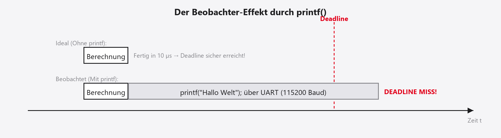

## Willkommen in der Systemanalyse!

- Herzlich Willkommen zum 7. Termin unserer Vorlesung.
- Letzte Woche: Wir haben zwei Kerne in einem Chip vernetzt.
- Die Realität im Labor: *Läuft das wirklich so, wie wir uns das gedacht haben?*
- Heute verlassen wir die reine Programmierung.
- Wir wechseln in die Rolle des **Analysten** und **System-Architekten**.
- Ziel: Wir beweisen mathematisch und physikalisch, dass unsere Deadlines eingehalten werden.

::: notes
Guten Morgen und herzlich willkommen zur siebten Vorlesung! In den letzten Wochen haben wir wie die Weltmeister programmiert. Letzte Woche haben wir sogar das Kunststück vollbracht, zwei völlig unterschiedliche Betriebssystemwelten auf zwei Kernen miteinander sprechen zu lassen. Aber Hand aufs Herz: Haben Sie im Labor wirklich gewusst, ob Ihr Ping-Pong-Code exakt so schnell lief, wie er sollte? Wenn die LED blinkte, waren wir zufrieden. In der Luftfahrt oder in der Automobilindustrie reicht "Es blinkt" aber nicht als Beweis für die Zertifizierung. Heute wechseln wir die Perspektive. Wir werden zu Analysten. Wir lernen, wie wir uns auf die Nanosekunde genau beweisen können, dass unser RTOS wirklich jede Frist einhält.
:::

## Agenda für heute

- Recap: Multicore-Kommunikation und ihre Latenzen.
- Die Grenzen der Sichtbarkeit: Warum klassisches Debugging (`printf`) tödlich ist.
- Der Heisenbug (Der Beobachter-Effekt der IT).
- ARM CoreSight: Wie Chips intern Daten nach außen funken.
- DWT, ITM und der heilige Gral: ETM (Instruction Trace).
- Timing-Metriken: WCET, Slack, Interrupt-Latenz, Netto vs. Brutto.
- TASKING BlueBox, winIDEA und OS-Awareness (`pxCurrentTCB`).

::: notes
Was genau steht heute auf der Agenda? Zuerst müssen wir uns eingestehen, dass unsere bisherigen Debugging-Methoden für harte Echtzeit völlig ungeeignet sind. Wir sprechen über das Phänomen des Heisenbugs. Danach schauen wir uns an, wie ARM dieses Problem auf Hardware-Ebene gelöst hat. Wir besprechen die Begriffe ITM, DWT und ETM. Anschließend diskutieren wir, welche Timing-Metriken uns eigentlich interessieren, wenn wir ein Steuergerät analysieren. Und zum Abschluss stelle ich Ihnen das sündhaft teure Werkzeug vor, das wir heute Nachmittag im Labor verwenden werden: die TASKING BlueBox, ein waschechter Hardware-Tracer.
:::

## Recap: Unser Multicore-System

- Letzte Woche auf dem STM32H755:
    - Cortex-M7 (Bare-Metal) setzt `m7_ready = 1`.
    - Cortex-M4 (FreeRTOS) wartet auf das Flag.
- Wir haben die MPU konfiguriert, um **Cache-Kohärenz** zu erzwingen.
- Das System lief flüssig im Terminal.
- **Die ungelösten Fragen:**
    - Wie viele Mikrosekunden vergingen *wirklich* zwischen dem Schreiben des M7 und dem Aufwachen des M4?
    - Hat FreeRTOS auf dem M4 beim Aufwachen sofort geschaltet, oder hat eine andere Task kurz blockiert?

::: notes
Kurzer Rückblick auf letzte Woche. Sie haben ein asymmetrisches Multiprocessing-System gebaut. Der M7 hat Daten in den Shared Memory gelegt und das Flag gesetzt. Wir haben gelernt, dass wir den Cache des M7 für diesen Speicherbereich deaktivieren müssen, damit der M4 die echten Daten sieht. Das Ping-Pong funktionierte. Aber: Haben Sie eine Ahnung, ob der M4 eine Mikrosekunde oder hundert Mikrosekunden gebraucht hat, um aufzuwachen? Was wäre passiert, wenn in genau diesem Moment der SysTick auf dem M4 gefeuert hätte? Bisher haben wir blind darauf vertraut, dass das System schnell genug ist.
:::

## Der Beobachter-Effekt in der Physik

- Aus der Quantenmechanik (und dem Alltag):
- *"Wer ein System misst, verändert unweigerlich dessen Zustand."*
- **Beispiel:** Prüfen des Reifendrucks.
    - Um zu messen, wie viel Luft im Reifen ist, müssen Sie das Ventil öffnen und das Manometer anschließen.
    - Dabei entweicht ein kleines bisschen Luft!
    - Der Druck nach der Messung ist *nicht mehr derselbe* wie vor der Messung.
- Gilt dieses physikalische Gesetz auch in der Software-Entwicklung? **JA!**

::: notes
Um zu verstehen, warum das Messen von Software so schwer ist, müssen wir einen kleinen Exkurs in die Physik machen. In der Quantenmechanik gibt es den berühmten Beobachter-Effekt. Die Kurzform lautet: Es ist physikalisch unmöglich, ein System zu beobachten, ohne es durch die Beobachtung zu verändern. Wenn Sie beim Auto den Reifendruck messen wollen, drücken Sie das Manometer auf das Ventil. Es zischt kurz. Ein bisschen Luft entweicht in das Messgerät. Das bedeutet: Der Druck, den Sie auf der Anzeige ablesen, ist bereits leicht geringer als der Druck, der vor der Messung im Reifen herrschte. Genau dieser Effekt holt uns in der Echtzeit-Programmierung erbarmungslos ein.
:::

## Klassisches Debugging: Die `printf`-Gefahr

- Die häufigste (und schlechteste) Debugging-Methode in C:
  `printf("Task A ist hier! Zeit = %d\n", ticks);`
- **Was passiert physikalisch?**
    - Das Wort „Hallo“ hat 5 Bytes; bei 8N1 sind das $5 \times 10 = 50$ Bits (Start- und Stop-Bit).
    - Bei Standard $115200$ Baud dauert ein Bit $\approx 8{,}68\,\text{µs}$.
    - „Hallo“ senden blockiert das System für $\approx 430\,\text{µs}$!
- *Während Sie versuchen zu messen, ob Ihre $50\,\text{µs}$ Frist gehalten wird, halten Sie das System für $430\,\text{µs}$ an!*

::: notes
Nehmen wir den Klassiker: `printf`. Sie wollen wissen, ob Task A rechtzeitig startet. Also schreiben Sie `printf("Task A ist hier")` in den Code. Sie denken, das sei eine harmlose Textausgabe. Schauen wir uns die Physik dahinter an. Das Wort "Hallo" besteht aus 5 Buchstaben. Über den UART-Port werden inklusive Start- und Stop-Bits (8N1) exakt 50 Bits übertragen. Bei 115200 Baud dauert ein Bit rund 8,7 Mikrosekunden. Das Senden von „Hallo“ blockiert Ihren Code für etwa 430 Mikrosekunden. Wenn Ihre eigentliche Deadline bei 50 Mikrosekunden lag, haben Sie Ihr System durch den bloßen Versuch der Beobachtung restlos zerstört.
:::

## Visualisierung: Der Beobachter-Effekt

{.nostretch}

- **Ideal:** Die Berechnung ist extrem kurz, die Deadline wird souverän eingehalten.
- **Beobachtet:** Der „harmlose“ `printf`-Aufruf bläht die Laufzeit so massiv auf, dass das System die rote Deadline verpasst (System-Crash!).
- *Hinweis:* Die Abbildung zeigt illustrativ `printf("Hallo Welt")`; die Rechnung oben nutzt bewusst das kürzere „Hallo“ (5 Bytes $\rightarrow$ $\approx 430\,\text{µs}$).

::: notes
Das Diagramm zeigt das visuell. Im idealen Fall dauert unsere Berechnung einen Wimpernschlag. Die rote Deadline-Linie ist weit entfernt. Nun bauen wir das `printf` ein, um das Timing zu überprüfen. Der riesige UART-Block schiebt sich in unseren Execution-Flow. Die Berechnung wird zwar fertig, aber das UART-Modul lässt uns warten. Wir verpassen die Deadline krachend. In dem Moment, in dem wir das `printf` wieder löschen, läuft das System wieder fehlerfrei.
:::

## Klassisches Debugging: Breakpoints

:::: {.columns}
::: {.column width="50%"}
- Wenn `printf` verboten ist, nutzen wir doch den Debugger (Breakpoints!).
- Sie setzen in der IDE einen roten Punkt in Zeile 42.
- **Was passiert in der CPU?**
    - Die Hardware hat spezielle Komparator-Register.
    - Wenn der Program Counter (`PC`) die Adresse von Zeile 42 erreicht, löst die CPU einen "Halt" aus.
:::
::: {.column width="50%"}
- **Die CPU stoppt (Core Halted):**
    - Es wird kein Assembler-Code mehr ausgeführt.
    - Sie können gemütlich im RAM Variablen ansehen.
:::
::::

- *Klingt perfekt, oder? Es gibt nur ein gigantisches Problem...*

::: notes
Gut, sagen Sie, wenn Printf verboten ist, nehme ich die Eclipse-IDE und setze einen Breakpoint. Das ist doch sauberes Debugging! Wenn Sie das tun, lädt die IDE die Speicheradresse dieser Code-Zeile in ein spezielles Komparator-Register der ARM-CPU. Sobald der Program Counter der CPU auf diese Adresse trifft, löst die Hardware den sogenannten Halt-Status aus. Der gesamte Cortex-M-Kern friert auf der Nanosekunde genau ein. Die Register ändern sich nicht mehr. Sie können gemütlich eine Tasse Kaffee trinken und sich in der IDE den Inhalt aller Variablen ansehen. Für Desktop-Entwickler ist das perfekt. Für uns Embedded-Entwickler ist es eine Todesfalle.
:::

## Das Problem des "Halt-States"

- Die CPU (der Code) stoppt. **Die physikalische Welt stoppt nicht!**
- Während Sie in Ruhe Ihre Variablen ansehen:
    1. Der Motorläufer dreht sich weiter (Sensor-Flanken kommen an).
    2. Der UART-Port empfängt weiter Bytes (Der Puffer läuft über!).
    3. Hardware-Timer zählen munter weiter.
- **Der Crash nach dem Resume (Play):**
    - Sie klicken auf "Play". Die CPU erwacht.
    - Plötzlich stehen 50 aufgestaute Hardware-Interrupts gleichzeitig vor der Tür.
    - Das OS wird mit ISRs geflutet $\rightarrow$ Stack Overflow oder Deadlock!

::: notes
Warum? Weil wir ein eingebettetes System bauen. Die CPU friert zwar ein, aber die physikalische Welt um uns herum friert nicht ein! Wenn Ihre CPU gerade einen Elektromotor bei 5000 Umdrehungen ansteuert und Sie klicken auf "Pause", dann dreht sich der Motor wegen der Trägheit weiter! Der Drehgeber sendet munter hunderte Sensor-Flanken an Ihren Mikrocontroller. Der Hardware-Puffer des UART-Ports läuft voll, weil der externe PC weiter Daten sendet. All das staut sich auf. Wenn Sie dann nach fünf Minuten Ihren Kaffee ausgetrunken haben und auf "Play" drücken, passiert das Unausweichliche: Die CPU wacht auf und wird sofort von 50 anstehenden Interrupts gleichzeitig erschlagen. Das System stürzt unweigerlich mit einem Stack Overflow oder völlig wirrem Timing ab. Sie können eine harte Echtzeitanwendung nicht einfach per Breakpoint anhalten!
:::

## Der Heisenbug

- Durch diese Effekte entsteht eine spezielle Klasse von Softwarefehlern.
- **Benannt nach Werner Heisenberg** (Heisenbergsche Unschärferelation).
- **Definition Heisenbug:**
    - Ein Bug, der *verschwindet* oder sein Verhalten *verändert*, sobald man versucht, ihn mit einem Debugger oder mit `printf` zu isolieren.
- **Die Ursache in RTOS-Systemen:**
    - Der Fehler war ein "Timing-Fehler" (z. B. eine hauchdünne Race Condition).
    - Durch das Anhalten oder Ausgeben von Text verändert sich das Timing so extrem, dass die Race Condition zufällig nicht mehr auftritt!

::: notes
Diese Phänomene führen zu einer Fehlerkategorie, die gestandene Programmierer zur Verzweiflung treibt: Dem Heisenbug. Benannt nach Werner Heisenberg und seiner Unschärferelation. Ein Heisenbug ist ein Softwarefehler, der sofort verschwindet, wenn Sie versuchen, ihn zu finden. Stellen Sie sich vor, Sie haben eine subtile Priority Inversion, die nur dann zuschlägt, wenn Task A exakt 2 Mikrosekunden nach Task B aufwacht. Das System stürzt ab. Sie bauen ein `printf` in Task A ein, um den Absturz zu finden. Das Printf verschiebt das Timing um 300 Mikrosekunden. Plötzlich wacht Task A nicht mehr gleichzeitig mit Task B auf. Die Race Condition tritt nicht mehr auf. Das System läuft stabil, solange das Printf drin ist. Sobald Sie den Code für die Auslieferung an den Kunden löschen, stürzt das Gerät wieder ab.
:::

## Der Workaround: Software Instrumentierung

- Wie haben wir uns in Termin 1 beholfen? Mit **GPIO Toggling**!
- Vor der Task: Pin auf HIGH. Nach der Task: Pin auf LOW.
- **Vorteil:** Extrem schnell (1-2 Taktzyklen). Zerstört das Timing kaum.
- **Nachteile:**
    1. **Pin-Mangel:** Sie haben keine 50 freien Pins, um 50 Tasks zu überwachen.
    2. **Intrusiv:** Sie verändern den Original-Code (`Toggle`-Befehle im Source Code).
    3. **Cache-Effekte:** Selbst eine Zeile Code mehr ändert das Compiler-Layout und kann den L1-Cache beeinflussen (Der Bug verschwindet wieder!).

::: notes
In der ersten Vorlesung haben wir das pragmatisch gelöst. Wir haben Software-Instrumentierung betrieben. Wir haben vor unserer Berechnung einen GPIO-Pin auf HIGH gesetzt und danach auf LOW. Mit dem Oszilloskop haben wir die Pulsweite gemessen. Das ist eine legitime Methode, da ein GPIO-Register-Schreibzugriff nur ein bis zwei Taktzyklen dauert und das Timing kaum zerstört. Aber auch diese Methode skaliert nicht. Sie haben auf Ihrem Controller keine 50 freien Pins für 50 FreeRTOS-Tasks. Außerdem ist es "intrusiv": Sie manipulieren den Source-Code. Manchmal reicht es schon aus, eine C-Zeile für einen Pin-Toggle hinzuzufügen, um das Alignment des Maschinencodes im Flash so zu verändern, dass der L1-Cache plötzlich anders arbeitet. Und zack – der Heisenbug schlägt wieder zu.
:::

## Wir brauchen: Non-Intrusive Observation

- Um RTOS-Probleme zu finden, brauchen wir eine Methode, die:
    1. Die CPU nicht für Mikrosekunden blockiert.
    2. Die CPU niemals anhält (keine Breakpoints).
    3. Keinerlei Code-Änderungen im C-Sourcecode erfordert!
- **Der Fachbegriff:** Rückwirkungsfreie Beobachtung (Non-Intrusive).
- Wie ist das physikalisch auf einem Mikrocontroller möglich?
- $\rightarrow$ **Mit Hardware-Trace-Technologie!**

::: notes
Wir stecken in einer Sackgasse. Um Echtzeit zu beweisen, brauchen wir eine Methode, die die CPU nicht blockiert, das System niemals anhält und idealerweise nicht eine einzige geänderte Zeile C-Code erfordert. Wir brauchen eine rückwirkungsfreie Beobachtung, im Fachjargon "Non-Intrusive Observation". Lange Zeit dachte man, das sei unmöglich. Aber moderne Chiphersteller haben das Problem auf Siliziumebene gelöst. Sie haben spezielle Netzwerke parallel zum eigentlichen Prozessor in das Silizium gebrannt: Die Hardware-Trace-Technologie. Und die schauen wir uns jetzt an.
:::

## Zusammenfassung Block 1

1. **Beobachter-Effekt:** Jeder Versuch, Timing per Software zu messen, verändert das Timing.
2. **`printf`** ist in der Echtzeit wegen massiver Latenzen ($>100\,\text{µs}$) streng verboten.
3. **Breakpoints** frieren die CPU ein, aber Peripherie/Interrupts laufen weiter $\rightarrow$ Systemcrash bei Wiederaufnahme.
4. **Heisenbugs** verbergen sich, wenn das Timing durch Debugging verschoben wird.
5. Die Lösung muss zu $100\%$ in Hardware integriert sein.

::: notes
Fassen wir das Debakel des klassischen Debuggings zusammen. "Printf" vernichtet harte Deadlines durch UART-Verzögerungen. Breakpoints zerstören den Zustand des Systems, weil sich aufstauende Hardware-Interrupts die Architektur beim Resume zerschießen. Heisenbugs treiben uns in den Wahnsinn. Die Konsequenz ist unumstößlich: Wir müssen das Debugging aus der Software herausholen und komplett in die Hardware verlagern.
:::

## Hardware-Trace: ARM CoreSight

- ARM (der Designer des Cortex-M7/M4) hat ein gigantisches Debug-Netzwerk parallel zur CPU entworfen: **CoreSight**.
- CoreSight besteht aus dedizierten Silizium-Blöcken, die den CPU-Kern "ausspionieren".
- Sie lesen Bus-Daten, ohne den eigentlichen AHB/AXI-Bus der CPU zu belasten.

```{.plantuml}
@startuml
skinparam backgroundColor transparent
skinparam defaultFontName "Inter, sans-serif"
skinparam defaultFontColor #1D1D1F
skinparam ArrowColor #86868B
skinparam NoteBackgroundColor #F5F5F7
skinparam NoteBorderColor #E5E5EA
skinparam rectangle {
  BackgroundColor #F5F5F7
  BorderColor #1D1D1F
}
skinparam ArrowColor #E2001A

rectangle "Cortex-M CPU" as CPU
rectangle "CoreSight Netzwerk" {
  [ITM] as ITM
  [DWT] as DWT
  [ETM] as ETM
  [TPIU] as TPIU
}

CPU .right.> ITM : "Spionage"
CPU .right.> DWT : "Spionage"
CPU .right.> ETM : "Spionage"

ITM --> TPIU
DWT --> TPIU
ETM --> TPIU

TPIU --> [Pins zur BlueBox]
@enduml
```

::: notes
Lernen Sie ARM CoreSight kennen. ARM hat erkannt, dass Entwickler ein Werkzeug brauchen, das unsichtbar ist. Sie haben deshalb ein komplettes, eigenständiges Netzwerk aus Logikgattern neben den eigentlichen Cortex-Kern gesetzt. Dieses Netzwerk nennt sich CoreSight. Es ist physikalisch so verdrahtet, dass es passiv auf den Bus-Leitungen der CPU „mitschnüffelt“, ohne dass der Datenfluss der CPU auch nur um einen einzigen Taktzyklus gebremst wird. CoreSight sammelt die Daten ein, bündelt sie und leitet sie an spezielle Pins nach draußen. Schauen wir uns die drei wichtigsten Schnüffler dieses Netzwerks an: ITM, DWT und ETM.
:::

## JTAG vs. SWD vs. Trace

- Bisher haben wir zum Flashen/Debuggen JTAG (alt, 5 Pins) oder SWD (Serial Wire Debug, modern, 2 Pins) genutzt
- SWD ist bidirektional: Der PC schickt einen Stopp-Befehl $\rightarrow$ Chip stoppt $\rightarrow$ PC fragt RAM ab $\rightarrow$ Chip antwortet
- Trace-Daten hingegen sind ein gigantischer unidirektionaler Wasserfall!
- Der Chip feuert Millionen von Statusmeldungen pro Sekunde nach außen (*Fire and Forget*)
- Der PC (oder die BlueBox) muss extrem schnell sein, um alles aufzufangen!

::: notes
Aber zunächst eine physikalische Klarstellung. Bisher haben Sie Ihren kleinen weißen ST-Link verwendet, der über das Serial Wire Debug-Protokoll, kurz SWD, mit dem Chip spricht. Das sind zwei kleine Kabel. Das Prinzip ist immer Frage und Antwort: Der PC sagt „Stopp“, die CPU stoppt. Der PC sagt „Gib mir Adresse X“, die CPU antwortet. Bei der Trace-Technologie drehen wir das Konzept um. Trace ist ein brutaler, eindimensionaler Wasserfall aus Daten. Die CPU hält nicht an. Sie feuert Millionen von kleinen Statuspaketen über separate Trace-Pins ungefragt nach außen. „Fire and Forget“. Wenn Ihr Analyse-Gerät am Schreibtisch zu langsam ist, um diesen Gigabit-Strom aufzufangen, sind die Daten für immer verloren.
:::

## Modul 1: Das ITM (Instrumentation Trace)

- Das „bessere `printf`“
- Die CPU schreibt einen Wert in ein spezielles ITM-Hardware-Register
- Der Unterschied zu UART:
  - Der Schreibzugriff auf das ITM-Register dauert typischerweise **einen Taktzyklus** (wenige Nanosekunden)!
  - Die CPU rechnet sofort weiter (asynchroner Trace).
  - Caveat: Bei vollem ITM-FIFO kann der Schreibzugriff kurz stallen.
  - Die CoreSight-Hardware verpackt das Byte im Hintergrund und schickt es asynchron nach draußen
- Latenz-Problem von $430\,\text{µs}$ gelöst! (Nur noch winzige Intrusion im Code)

::: notes
Das einfachste CoreSight-Modul ist das ITM, die Instrumentation Trace Macrocell. Das ist unser direkter Ersatz für „printf“. Anstatt einen Buchstaben mühsam in das UART-Register zu schieben und zu warten, bis er gesendet ist, schiebt unser C-Code den Buchstaben in ein spezielles ITM-Register. Das dauert typischerweise einen Taktzyklus (wenige Nanosekunden). Der Kern ist sofort fertig und rechnet nahtlos im Programm weiter. Das ITM-Hardware-Modul übernimmt den Buchstaben, verpackt ihn in ein Trace-Paket und schiebt ihn asynchron nach draußen. Caveat: Ist der interne ITM-FIFO voll, kann der Schreibzugriff kurz stallen — bei massivem Logging also nicht völlig „kostenlos“. Trotzdem haben wir unser 430-Mikrosekunden-Latenz-Problem auf wenige Nanosekunden plus seltene FIFO-Stalls reduziert.
:::

## Modul 2: Das DWT (Data Watchpoint & Trace)

- Jetzt wird es komplett rückwirkungsfrei (0 Code-Änderungen)!
- Das DWT beobachtet den RAM-Speicherbus der CPU wie ein Scharfschütze
- Sie konfigurieren im externen Tool: „Beobachte die Adresse von `sd.m7_ready`.“
- Jedes Mal, wenn die CPU diesen Speicherbereich beschreibt oder liest, erzeugt das DWT ein Hardware-Paket (inklusive des neuen Wertes!)
- Die CPU bekommt davon nichts mit (0 Taktzyklen Overhead!)
- Perfekt, um globale Variablen im OS (z. B. Task-Zustände) zu überwachen

::: notes
Aber das ITM erforderte immer noch, dass wir ein printf durch einen ITM-Aufruf im Sourcecode ersetzen mussten. Modul Nummer 2, das DWT (Data Watchpoint and Trace), ist magisch. Es ist ein waschechter Hardware-Schnüffler am Speicherbus. Sie tippen in Ihr Analyse-Tool am PC einfach den Namen der C-Variable ein, z. B. unser `m7_ready`-Flag. Das Tool lädt die Hex-Adresse über SWD still und heimlich in das DWT-Modul. Ab diesem Moment beobachtet die DWT-Hardware jeden einzelnen Speicherzugriff der CPU. Wenn der M7 nun eine „1“ in diese Adresse schreibt, greift das DWT den Wert vom Bus ab und funkt ihn nach außen zum PC. Auf der CPU entsteht exakt 0,0 Prozent Overhead. Der Code bleibt unberührt. Das ist pure Non-Intrusive Observation.
:::

## Modul 3: Das ETM (Embedded Trace)

- Der Heilige Gral der Embedded-Entwicklung
- Das ETM protokolliert die Programmausführung (Instruction Trace)
- Es verrät uns lückenlos, welche C-Zeile (bzw. Assembler-Instruktion) die CPU gerade ausgeführt hat!
- Das Bandbreiten-Problem:
  - Bei $400\,\mathrm{MHz}$ führt die CPU $400\,000\,000$ Befehle pro Sekunde aus
  - Wenn jeder Befehl $4\,\mathrm{Bytes}$ hat, bräuchten wir $1{,}6\,\mathrm{GB/s}$ Bandbreite!
  - Das schaffen die Pins des Chips nicht
- Wie löst ARM dieses Problem?

::: notes
Das absolute Highlight von CoreSight ist Modul Nummer 3: Das ETM, die Embedded Trace Macrocell. Sie zeichnet nicht nur Variablen auf, sie protokolliert jeden Schritt des Program Counters. Sie liefert uns einen lückenlosen Film, welche Zeile C-Code die CPU gerade abarbeitet. Aber hier stoßen wir an die Grenzen der Physik. Bei 400 Megahertz Taktung führt der Chip 400 Millionen Befehle pro Sekunde aus. Ein Trace-Paket bräuchte mindestens 4 Byte. Das wären 1,6 Gigabyte pro Sekunde! Es gibt keinen Stecker an einem STM32, der diese Bandbreite auch nur ansatzweise nach außen pumpen könnte. ARM musste hier einen genialen Kompressions-Trick erfinden.
:::

## Die ETM-Kompression: Nur Sprünge!

- ARM komprimiert den ETM-Datenstrom extrem intelligent:
  - Es wird nicht jeder Befehl gemeldet
  - Die CPU läuft ohnehin strikt sequenziell von oben nach unten, bis ein „Sprung“ (Branch, If-Abfrage, Interrupt) auftritt
  - Das ETM funkt nur: „Ich bin bei der If-Abfrage an Adresse `0x0800` gesprungen (True) oder nicht gesprungen (False).“
- Das externe Tool am PC lädt die `.elf`-Datei, kennt den C-Code und rekonstruiert am PC den exakten Pfad der CPU!

::: notes
Wie bringt man 1,6 Gigabyte auf wenige Megabyte herunter? Das ETM schickt einfach fast gar nichts nach draußen! Ein Prozessor arbeitet Assembler-Befehle normalerweise stur der Reihe nach von oben nach unten ab. Das ist langweilig und berechenbar. Wir müssen nicht wissen, dass Zeile 2 nach Zeile 1 kam. Spannend wird es nur an den Kreuzungen: Eine IF-Bedingung, ein Funktionsaufruf oder ein Hardware-Interrupt. Das ETM schickt nur kleine, 1-Bit-große Pakete, die sagen: „An der Kreuzung X bin ich links abgebogen“. Das externe Trace-Werkzeug am PC kennt unseren C-Code und die `.elf`-Datei. Es nimmt diese Kreuzungs-Bits und zeichnet auf dem PC im Nachhinein den gesamten Laufweg der CPU als kontinuierlichen Film nach. Genial!
:::

## Die TPIU und der physikalische Stecker

- Alle Module (ITM, DWT, ETM) schicken ihre Daten zur TPIU (Trace Port Interface Unit)
- Die TPIU multiplext die Ströme und leitet sie an die Pins des STM32
- 1-Bit SWO (Serial Wire Output):
  - Standard auf günstigen Nucleo-Boards
  - Reicht für ITM (`printf`) und ein paar DWT-Variablen — zu langsam für ETM!
- 4-Bit Parallel Trace Port:
  - 4 Daten-Pins + 1 Clock-Pin (sehr schnell)
  - Notwendig für volles ETM (Instruction Trace)
  - Benötigt einen teuren, 20-poligen High-Density-Stecker auf dem Board

::: notes
All diese geballten Daten aus ITM, DWT und ETM fließen intern im Chip in die TPIU, eine Multiplexer-Einheit. Sie mixt die Datenströme zusammen und drückt sie aus den Beinchen des Chips heraus. Die meisten günstigen Bastelboards nutzen SWO. Das ist ein einziges Käbelchen. Das reicht wunderbar für ein paar schnelle Printf-Ersatz-Meldungen des ITM, ist aber viel zu schwachbrüstig für den gigantischen Sprung-Datenstrom des ETM. Wer wirklich tief in die Architektur blicken will, muss beim Platinendesign vier parallele Pins und einen Takt-Pin, den sogenannten Trace-Port, vorsehen. Dieser wird oft in einen extrem dichten 20-poligen Stecker auf der Platine herausgeführt.
:::

## Zusammenfassung CoreSight {background-color="#F5F5F7"}

- **Hardware-Trace** ist völlig rückwirkungsfrei (Non-Intrusive).
- **ITM:** Die schnelle, saubere Alternative zu `printf()`.
- **DWT:** Hardware-Spionage auf exakten RAM-Adressen (ohne Code-Overhead).
- **ETM:** Rekonstruktion des gesamten C-Code-Pfades durch Protokollierung aller Sprünge (Branches).
- Um diese extremen Datenmassen aufzufangen, brauchen wir externe Profi-Hardware.

::: notes
Fassen wir das CoreSight-Konzept noch einmal zusammen, bevor wir uns ansehen, was wir mit diesen Daten tun. Wir haben eine Architektur, die unsichtbar neben der CPU läuft. Mit dem ITM haben wir das Printf-Problem gelöst. Das DWT ist unser Scharfschütze für bestimmte C-Variablen. Das ETM ist die Videokamera, die unseren gesamten Programmablauf filmt, ohne die CPU auch nur um eine Nanosekunde zu bremsen. Diese Datenmenge ist so gigantisch, dass wir sie nicht mehr über USB-Kabel leiten können, was uns direkt zum nächsten Thema führt: Was berechnen wir aus diesen Gigabytes an Trace-Daten?
:::

## Die Pflicht zur Systemanalyse

- Warum treiben wir diesen immensen technischen Aufwand?
- **Die Normen der Industrie:**
    - **ISO 26262** (Automotive Functional Safety, bis ASIL D).
    - **DO-178C** (Luftfahrt).
    - **IEC 61508** (Industrie / Medizin).
- *Es reicht nicht, wenn die Software „beim Testen auf dem Schreibtisch nicht abgestürzt ist“.*
- Sie müssen der Zulassungsbehörde **mathematisch und empirisch beweisen**, dass jede Deadline zu 100 % eingehalten wurde!

::: notes
Warum geben Firmen Millionen für Trace-Hardware aus? Wegen der Zertifizierung. Wenn Sie eine Software für das ABS-System in einem Auto oder die Flugsteuerung eines Airbus schreiben, unterliegen Sie strengen Normen wie der ISO 26262 oder der DO-178C. Wenn die Zulassungsbehörde fragt: „Hält Ihre Motor-Task immer ihre 1-Millisekunden-Deadline ein?“, dann dürfen Sie nicht antworten: „Ja, wir haben das auf dem Schreibtisch ausprobiert und es sah flüssig aus.“ Sie müssen einen physikalischen Beweis vorlegen. Sie müssen die Worst-Case-Szenarien ausgemessen haben. Und genau dafür brauchen wir die Timing-Metriken aus dem Hardware-Trace.
:::

## Metrik 1: Empirische WCET (Mess-WCET)

:::: {.columns}
::: {.column width="50%"}
- In Termin 2 haben wir die WCET ($C_i$) geschätzt. Jetzt messen wir sie!
- Wir lassen das ETM den Code filmen.
- Das Analyse-Tool zählt die CPU-Taktzyklen exakt mit.
- Aus $1\,000\,000$ Durchläufen extrahiert das Tool den beobachteten Maximalwert (inkl. Pipeline-Stalls und Cache-Misses) — die empirische WCET-Schätzung.
:::
::: {.column width="50%"}
- *Diesen Wert nutzen wir als **obere beobachtete Schranke** (Mess-WCET) für $C_i$ in der Rate-Monotonic-Formel ($U \le 69{,}3\,\%$) — nicht als formal bewiesenen Worst Case.*
:::
::::

::: notes
Die wichtigste Metrik, die wir aus dem ETM-Trace extrahieren, ist unsere alte Bekannte: Die Worst-Case Execution Time, die WCET. In der zweiten Vorlesung haben wir dafür Platzhalter-Zahlen in unsere Formel eingesetzt. Jetzt messen wir eine empirische obere Schranke — die Mess-WCET. Die externe Trace-Box filmt über Nacht Millionen von Ausführungen Ihrer Task. Am nächsten Morgen schauen Sie in die Software und filtern nach der absoluten Maximalzeit unter den beobachteten Läufen. Da der Trace live auf der echten Hardware lief, sind Pipeline-Verzögerungen, Cache-Fehlschläge und Bus-Staus bereits physikalisch enthalten. Wichtig: Das ist nicht der formal bewiesene Worst Case aller denkbaren Pfade, sondern die beste beobachtete obere Schranke aus dem Test. Diese Mess-WCET setzen wir vorsichtig als $C_i$ in unsere RMS-Formel ein.
:::

## Metrik 2: Deadline-Verifizierung

- Hat Task A wirklich jede Deadline eingehalten?
- Der Trace-Analysator kennt durch OS-Awareness (dazu später mehr) die Aufwachzeitpunkte und Fristen.
- Wir suchen im Trace-Protokoll nach dem geringsten **Slack** (Puffer).
- **Slack-Time:** Die Zeitspanne zwischen dem Ende der Task-Ausführung und dem tatsächlichen Eintreten der Deadline.
- *Ist der Slack jemals negativ, haben wir ein unzulässiges System!*

::: notes
Neben der reinen Rechenzeit müssen wir prüfen, ob das System planmäßig läuft. Das Analyse-Tool gleicht die Start- und Endzeiten der Tasks mit dem FreeRTOS-Scheduler ab. Es berechnet die Slack-Time. Das ist Ihr Sicherheitspuffer. Wie viel Zeit war noch übrig, bevor die rote Deadline-Linie überschritten wurde? Wenn Sie einen Testlauf über ein Wochenende machen und das Tool findet auch nur einen einzigen Durchlauf, bei dem der Slack negativ war, wissen Sie: Ihr System ist für den Straßeneinsatz illegal. Sie müssen die Architektur ändern oder Code optimieren.
:::

## Metrik 3: Interrupt-Latenz {background-color="#FFFFFF"}

- Wie schnell reagiert das System auf die physische Außenwelt?
- **Die Messung (End-to-End):**
    1. **Zeitpunkt A:** Flanke am echten Hardware-Taster geht auf HIGH. (Gemessen über einen externen Logikanalysator-Kanal der Trace-Box).
    2. **Zeitpunkt B:** Das ETM meldet den Eintritt in die erste C-Zeile der `StartButtonTask` (Bottom-Half).
- Die Differenz ($B - A$) ist unsere **garantierte Systemlatenz**.
- Ein perfekter Weg, um die Effizienz des *Deferred Interrupt Processing*-Musters aus Woche 5 zu beweisen!

::: notes
Die dritte wichtige Metrik ist die Reaktionszeit auf die echte Welt. Wie messen Sie, wann ein Button gedrückt wurde? Profi-Tracer haben oft einen integrierten Logikanalysator, der an die Platine geklemmt wird. Die Box sieht also elektrisch, wann der Pin HIGH wird. Das ist Zeitpunkt A. Millisekundenbruchteile später registriert das ETM, dass die CPU in die C-Task für den Button springt. Das ist Zeitpunkt B. Die Differenz ist unsere reine End-to-End-Hardwarelatenz. Damit beweisen Sie der TÜV-Behörde, dass Ihr Deferred-Interrupt-Muster aus Vorlesung 5 tatsächlich in den vorgeschriebenen 500 Mikrosekunden reagiert hat.
:::

## Netto-Rechenzeit vs. Brutto-Antwortzeit

```{.plantuml}
@startuml
skinparam backgroundColor transparent
skinparam defaultFontName "Inter, sans-serif"
skinparam defaultFontColor #1D1D1F
skinparam ArrowColor #86868B
skinparam NoteBackgroundColor #F5F5F7
skinparam NoteBorderColor #E5E5EA
skinparam timing {
  BackgroundColor #FFFFFF
  BorderColor #E5E5EA
  LineColor #1D1D1F
  SignalColor #E2001A
}

robust "Task A (Low Prio)" as TA

@0
TA is Blocked
@1
TA is Ready : Timer weckt auf
@2
TA is Running : Rechnet (Netto)
@4
TA is Ready : Präemptiert durch Task B!
@6
TA is Running : Rechnet weiter (Netto)
@7
TA is Blocked : Fertig.
@enduml
```

- Netto-Rechenzeit (WCET): $2\,\mathrm{ms} + 1\,\mathrm{ms} = \mathbf{3\,\mathrm{ms}}$. (Dies ist die CPU-Zeit).
- Brutto-Antwortzeit (Response Time $R$): Von $t=1$ bis $t=7 = \mathbf{6\,\mathrm{ms}}$.
- Der Tracer berechnet beide Werte präzise und trennt OS-Overhead sauber heraus!

::: notes
Ein häufiger Fehler bei der Timing-Analyse ist die Verwechslung von Netto und Brutto. Hier im PlantUML-Diagramm sehen Sie Task A. Sie wird bei $t=1$ geweckt, wartet kurz, rechnet 2 Millisekunden, wird präemptiert, rechnet noch eine Millisekunde und ist fertig. Die Netto-Rechenzeit (unsere WCET) beträgt also 3 Millisekunden. Aber die Brutto-Antwortzeit, die Response Time $R$ aus unseren Formeln, beträgt 6 Millisekunden! Sie beginnt beim Weckruf und endet beim Einschlafen. Ein Hardware-Tracer unterscheidet diese Werte automatisch. Wenn Sie das mit Software-`printf` messen würden, wüssten Sie nie, ob Ihr Code zu langsam war, oder ob er einfach nur zwischendurch viermal präemptiert wurde.
:::

## Metrik 4: Context Switch Overhead {background-color="#F5F5F7"}

- In unseren Schedulability-Modellen nehmen wir oft an: OS-Overhead $= 0$.
- Die Realität sieht anders aus.
- Der Tracer zeigt exakt, wie viele Taktzyklen die CPU in der `PendSV_Handler`-Assembler-Routine verbringt.
- Ergebnis: Wir sehen die echten Kosten von FreeRTOS (z. B. $2{,}5\,\text{µs}$ pro Wechsel).
- Fließt in komplexe Response-Time-Analyse-Formeln als Korrekturfaktor ein.

::: notes
Ein weiterer Aspekt ist der OS-Overhead. Wenn wir ein System mathematisch modellieren, tun wir oft so, als wäre der Context Switch kostenlos. Die Wahrheit ist: Die Register müssen auf den Stack, Listen müssen sortiert werden. Da das ETM jeden Funktionsaufruf filmt, können wir uns exakt ansehen, wie viele Taktzyklen der Prozessor in der PendSV-Routine von FreeRTOS verbracht hat. Wir erhalten den präzisen Overhead in Mikrosekunden und können diesen als Straffaktor auf unsere mathematischen Echtzeit-Formeln aufschlagen, um unsere Sicherheitspuffer noch robuster zu berechnen.
:::

## Ausblick: Code Coverage (Testabdeckung)

- Der Tracer wird nicht nur für das Timing, sondern auch für Software-Tests genutzt.
- Hat unser Testlauf wirklich jede C-Zeile ausgeführt?
- Die Metriken:
    - **C0** (Statement Coverage): Wurde jede Code-Zeile $\ge 1\times$ berührt?
    - **C1** (Branch Coverage): Wurde bei jedem `if(a && b)` sowohl der TRUE- als auch der FALSE-Pfad betreten?
    - **MC/DC** (Modified Condition/Decision Coverage): Hatte jede einzelne Sub-Bedingung einen nachweisbaren Effekt? (In ISO 26262 für ASIL D *highly recommended* — absolute Pflicht analog DO-178C Level A nur in der Avionik).
- Hardware-Trace liefert diese Daten zu $100\,\%$ rückwirkungsfrei, ohne den C-Code mit Test-Makros zu instrumentieren!

::: notes
Neben dem reinen Timing liefert uns das ETM noch ein grandioses Nebenprodukt: Die Code Coverage, die Testabdeckung. Wenn Sie Ihr Steuergerät testen, müssen Sie beweisen, dass Sie keinen toten Code ausgeliefert haben. Wurde jede IF-Abfrage während der Testfahrt mindestens einmal mit TRUE und einmal mit FALSE durchlaufen? Das ETM liefert diese Antworten kostenlos mit, da es jeden Sprung protokolliert. Wir müssen unseren schönen Release-Code nicht mit hässlichen Software-Countern verunstalten, um Testdaten zu sammeln. Die Trace-Hardware macht das völlig unsichtbar.
:::

## Das Werkzeug: In-Circuit Emulator (ICE)

- Wir haben die Metriken. Wir haben die Cortex-Hardware (CoreSight).
- Jetzt brauchen wir das Bindeglied am Schreibtisch: Den Hardware-Tracer.
- **ICE** (In-Circuit Emulator):
    - Historischer Begriff, als man Prozessoren noch physikalisch auf der Platine durch Emulatoren ersetzte.
    - Heute: Leistungsstarke externe Box, die via JTAG/Trace-Port mit der On-Chip-Debug-Hardware kommuniziert.

::: notes
Wir haben jetzt viel über Daten und Normen gesprochen. Aber wie kommt der Datenstrom auf unseren PC-Bildschirm? Wir brauchen ein Interface. Der klassische Fachbegriff dafür ist ICE, In-Circuit Emulator. Ganz früher, in den 80er Jahren, hat man den Mikrocontroller tatsächlich von der Platine ausgelötet und einen dicken Kabelbaum eingesteckt, der zu einem Kühlschrank-großen Emulator führte, um ins System zu schauen. Heute sitzen die Chips fest auf der Platine. Das ICE steckt heute in kleinen Kästchen, die sich über den 20-poligen Trace-Stecker mit dem CoreSight-Netzwerk im Chip verbinden.
:::

## Vorstellung: TASKING BlueBox {background-color="#FFFFFF"}

:::: {.columns}
::: {.column width="55%"}
- Im Labor nutzen wir Systeme der Firma TASKING (ehemals iSYSTEM).
- Typisches Modell: BlueBox iC5700.
- Ein Industrie-Standard-Gerät.
- **Architektur:**
    - **Active Probe:** Ein kleiner Stecker direkt am Board (verhindert Signal-Reflexionen bei $400\,\mathrm{MHz}$).
    - **FNet:** Ein Flachbandkabel leitet die Rohdaten zur Box.
    - **BlueBox:** Ein mächtiges FPGA entpackt die ETM-Daten live und puffert sie in Gigabytes an RAM.
    - **PC-Uplink:** Gigabit-Ethernet / USB 3.0.
:::
::: {.column width="45%"}
- *(Solche Geräte kosten oft so viel wie ein gut ausgestatteter Mittelklassewagen — behandeln Sie sie im Labor entsprechend vorsichtig!)*
:::
::::

::: notes
Hier ist sie: Die TASKING BlueBox. Das ist der Ferrari unter den Debugging-Tools. Sie finden diese Boxen bei Bosch, Continental und in jedem großen Embedded-Projekt. Die Architektur ist durchdacht: Das Gerät, das Sie auf Ihr Board stecken, ist nur eine kleine „Active Probe“. Bei Taktfrequenzen von mehreren hundert Megahertz können Sie Signale nicht über lange Kabel schicken, ohne dass sie durch physikalische Reflexionen zerstört werden. Die Probe greift das Signal ab und schickt es digital zur Hauptbox. Dort sitzt ein frei programmierbarer FPGA-Chip, der die gepackten ARM-Signale entschlüsselt, sortiert und über ein dickes Gigabit-Netzwerkkabel in Ihren PC pumpt. Ich muss nicht extra erwähnen, dass diese Geräte unfassbar teuer sind. Gehen Sie im Labor bitte sehr sanft mit den Stecker-Pins um!
:::

## Die IDE: winIDEA

- Hardware nützt nichts ohne gute Software.
- Wir verlassen heute die STM32CubeIDE zum Analysieren.
- Die TASKING-Software heißt **winIDEA**.
- Was macht winIDEA?
    - Konfiguriert die BlueBox und lädt die Firmware in den STM32.
    - Liest die `.elf`-Datei des Compilers.
    - Stellt den Quellcode und die Assembler-Verknüpfung dar.
    - Analysiert den hochgeladenen ETM-Trace-Strom und rendert die visuelle Timeline.

::: notes
Auf der PC-Seite nutzen wir eine spezielle Software. Wir verlassen heute für die Analyse unsere vertraute Eclipse-Umgebung und öffnen winIDEA. Diese Software ist das Cockpit für die BlueBox. Sie übernimmt das Flashen, startet das Board und — das ist ihre Hauptaufgabe — sie interpretiert den gewaltigen Datenstrom. winIDEA rendert die Millionen von ETM-Paketen in eine wunderschöne visuelle Timeline, die wir durchscrollen können.
:::

## Die Magie der `.elf`-Datei {background-color="#F5F5F7"}

- Woher weiß winIDEA, welche Hex-Adresse zu welcher C-Zeile gehört?
- Das ETM meldet nur: „Sprung zu `0x08001A4C`“.
- Die `.elf`-Datei (Executable and Linkable Format) enthält nicht nur den Maschinencode!
- Sie enthält Debug-Symbole (DWARF-Format):
    - Eine gigantische Zuordnungstabelle:
    - `0x08001A4C` $\leftrightarrow$ Funktion `StartButtonTask()` $\leftrightarrow$ `main.c`, Zeile 142.
- **Wichtig:** Sie müssen im GCC-Compiler das Debugging-Flag `-g` aktiviert haben, sonst fehlt diese Tabelle!

::: notes
Aber woher weiß die Software eigentlich, was diese Nullen und Einsen bedeuten? Die BlueBox empfängt vom ETM ja nur stumpfe Hex-Speicheradressen: „Bin zu 0x08001A4C gesprungen“. Um daraus den Text „StartButtonTask“ zu machen, liest winIDEA die `.elf`-Datei ein, die unsere CubeIDE beim Kompilieren ausspuckt. Neben dem reinen Maschinencode enthält diese Datei nämlich die sogenannten DWARF-Debug-Symbole. Das ist ein gigantisches Wörterbuch. Es übersetzt jede Hex-Adresse auf den Millimeter genau in eine Zeile Ihres C-Quellcodes. Dafür muss aber zwingend in den Compiler-Einstellungen das Flag `-g` gesetzt sein, sonst generiert GCC dieses Wörterbuch erst gar nicht.
:::

## Der Profiler und Trigger

- Wir können nicht unendlich lange aufzeichnen (Speicher der BlueBox ist begrenzt).
- Wir nutzen Hardware-Trigger, um die Nadel im Heuhaufen zu filmen!
- **Beispiel Trigger-Bedingung:**
    - „Zeichne nichts auf …“
    - „… bis Variable `error_flag == 1` geschrieben wird (DWT-Erkennung).“
    - „… ab dann zeichne 10 Sekunden lang ALLES (ETM) auf!“
- So fangen wir den Heisenbug genau im Moment seines Auftretens.

::: notes
Da selbst die gigantischen RAM-Puffer der BlueBox bei 1,6 Gigabyte pro Sekunde irgendwann voll sind, können wir nicht tagelang aufzeichnen. Wir müssen intelligent aufzeichnen. Hier kommen die Hardware-Trigger ins Spiel. Sie konfigurieren das DWT-Modul in winIDEA so, dass es lauscht, bis eine bestimmte Fehlervariable im RAM auf 1 gesetzt wird. Sobald das passiert, drückt die Hardware virtuell auf den Aufnahme-Knopf und das ETM filmt die Sekunden nach dem Crash. Sie sparen sich Gigabytes an unnötigem Rauschen und filtern gezielt nach dem Heisenbug.
:::

## Das Problem der OS-Sichtbarkeit

- Wir haben jetzt die C-Funktionen (`StartHeavyMath`, `StartHeartbeat`).
- Aber der Tracer weiß nicht, dass das FreeRTOS-Tasks sind!
- Für die Hardware ist das alles einfach nur ein linearer Strom von C-Funktionen, der ab und zu von einer Assembler-Routine (`PendSV`) unterbrochen wird.
- Wie erzeugen wir ein klares Task-Gantt-Chart, bei dem wir sehen, wann Task A und wann Task B „Running“ war?

::: notes
Ein letztes konzeptionelles Problem müssen wir lösen. Die Hardware filmt C-Funktionen. Aber sie hat nicht die geringste Ahnung, was FreeRTOS ist. Für die Hardware sind Tasks keine Objekte, sondern einfach nur Code-Adressen im Flash. Wir wollen in winIDEA aber bunte Balken sehen, die uns zeigen, welche Task gerade die CPU besitzt. Wir brauchen also eine Möglichkeit, dem Hardware-Tracer beizubringen, wie unser C-Betriebssystem intern funktioniert.
:::

## OS-Awareness (Betriebssystem-Bewusstsein) {background-color="#FFFFFF"}

- Tracer wie die BlueBox besitzen OS-Awareness.
- Sie können interne Strukturen von OSEK, AUTOSAR oder FreeRTOS lesen.
- **Der FreeRTOS-Trick:**
    - In FreeRTOS gibt es eine globale System-Variable:
      `TCB_t * volatile pxCurrentTCB;`
    - Sie zeigt immer auf die Task, die gerade die CPU besitzt.
    - Wenn der Scheduler (`PendSV`) die Task wechselt, ändert er diese Variable!

::: notes
Diese Funktion nennt man OS-Awareness, Betriebssystem-Bewusstsein. Top-Tracer kennen die Interna von FreeRTOS. Das Prinzip ist bestechend einfach. Im C-Code von FreeRTOS, tief vergraben in `tasks.c`, gibt es einen globalen Pointer namens `pxCurrentTCB`. Dieser Pointer ist die absolute Wahrheit im System. Er zeigt immer, in jeder Mikrosekunde, auf den Task Control Block der Task, die gerade läuft. Wenn der Scheduler eine Präemption durchführt, besteht seine wichtigste Handlung darin, diese Variable auf die neue Task umzuschreiben.
:::

## Wie winIDEA FreeRTOS visualisiert

- winIDEA sucht in der `.elf`-Datei nach der Speicheradresse von `pxCurrentTCB`.
- winIDEA programmiert das DWT-Modul in der Hardware so, dass es exakt und nur diese RAM-Adresse beobachtet.
- Sobald der FreeRTOS-Scheduler den Pointer ändert, funkt das DWT die neue Adresse an die BlueBox.
- winIDEA gleicht den neuen TCB-Pointer mit der internen FreeRTOS-Task-Liste ab und zeichnet den Balken für „Task B“ ab sofort auf „Running“.
- Ergebnis: Eine $100\,\%$ präzise Echtzeit-Visualisierung des Schedulers!

::: notes
Und so baut winIDEA das Balkendiagramm auf: Es schaut in die `.elf`-Datei und sucht die Hex-Adresse von `pxCurrentTCB`. Dann programmiert es das DWT-Modul im Chip heimlich so, dass es als Wächter vor genau dieser Adresse steht. Jedes Mal, wenn das Betriebssystem eine andere Task auswählt, ändert sich der Pointer. Das DWT erkennt den Schreibzugriff und feuert eine Trace-Nachricht über den Port zum PC. Die Software am PC liest den Pointer, schaut in der FreeRTOS-Datenstruktur nach, welcher Name („Heartbeat“) dahintersteckt, und zeichnet ab sofort den Zeitstrahl für diese Task weiter. Das ist High-End-Analyse in Vollendung.
:::

## Der OSEK/ORTI-Standard (Automotive)

- **ORTI** (OSEK Run Time Interface) ist die klassische Automotive-/OSEK-Schnittstelle:
  - Textdatei, die dem Debugger die Memory-Map des OSEK/AUTOSAR-OS offenlegt (Tasks, Queues, Prioritäten).
- FreeRTOS in winIDEA ist etwas anderes:
  - Die FreeRTOS-Awareness kommt über ein **Plugin** bzw. Strukturwissen (`pxCurrentTCB`, TCB-Layout) — nicht über ORTI.
- Ergebnis: Live-Sicht auf Ready-/Blocked-Listen und Queues, unabhängig vom Automotive-ORTI-Pfad.

::: notes
Wichtig trennen: ORTI ist der Automotive-/OSEK-Standard, mit dem Debugger die OS-Memory-Map eines OSEK- oder AUTOSAR-Classic-Systems lesen. FreeRTOS spricht kein ORTI. In winIDEA kommt die FreeRTOS-Awareness über ein Plugin und das Wissen um Strukturen wie `pxCurrentTCB`. Sie sehen dann trotzdem live, welche Task rechnet, wer in der Ready-Liste wartet und wer auf einen UART-Mutex blockiert — nur eben nicht über die ORTI-Datei.
:::

## Laborvorbereitung: Tracing im Einsatz {background-color="#F5F5F7"}

- **Ziel für heute Nachmittag:**
  Wir nehmen unser kaputtes Ping-Pong-Projekt aus Termin 6 (ohne MPU) und betrachten den Cache-Coherency-Failure durch die Augen der BlueBox!
- **Schritt 1: Hardware-Setup**
    - Board ausschalten.
    - 20-Pin-Flachbandkabel der BlueBox vorsichtig aufstecken.
    - Board und BlueBox einschalten.
- **Schritt 2: winIDEA Workspace**
    - Starten Sie winIDEA.
    - Laden Sie beide `.elf`-Dateien (CM7 und CM4) in den Workspace.
    - Konfigurieren Sie die Taktfrequenz im Tool zwingend auf $400\,\mathrm{MHz}$ (sonst stimmen die Zeitstempel nicht).

::: notes
Kommen wir zur Laboraufgabe für heute. Sie werden den kaputten Multicore-Ping-Pong-Code von letzter Woche analysieren. Genau den Code, bei dem der M7 wegen des L1-Caches die Daten nicht in den echten SRAM geschrieben hat und der M4 eingefroren ist. Verkabeln Sie vorsichtig die BlueBox. Richten Sie in winIDEA einen Workspace ein und laden Sie die beiden Firmware-Dateien für den Cortex-M7 und den Cortex-M4 hinein. Vergessen Sie nicht, die korrekte Taktfrequenz der CPU in winIDEA einzutragen, sonst werden Ihre Mikrosekunden-Achsen alle falsche Werte anzeigen.
:::

## Schritt 3–4: FreeRTOS Awareness & Profiler

- **Schritt 3: FreeRTOS Awareness**
    - Gehen Sie in winIDEA auf Plugins $\rightarrow$ FreeRTOS.
    - Das Plugin liest nun automatisch die `.elf` des CM4 und sucht nach `pxCurrentTCB`.
- **Schritt 4: Profiler einrichten**
    - Öffnen Sie den Analyzer / Profiler.
    - Wir richten das DWT-Tracing ein:
    - Fügen Sie die Variable `sd.m7_ready` als DWT-Data-Trace hinzu!

::: notes
In Schritt 3 schalten Sie die FreeRTOS-Awareness über das Plugin-Menü ein. Dann richten Sie den Profiler ein. Wir wollen heute nicht den vollen Instruction Trace (ETM) aufzeichnen, das sprengt anfangs den Rahmen. Wir nutzen gezielt das DWT. Konfigurieren Sie den Profiler so, dass er ausschließlich die RAM-Adresse unseres Ping-Pong-Flags beobachtet. Wir wollen sehen, wann genau sich dieser Wert ändert.
:::

## Schritt 5: Die Aufnahme & Analyse

- Drücken Sie auf Record (roter Punkt) und lassen Sie das Board laufen.
- Beenden Sie die Aufnahme.
- **Das Aha-Erlebnis im Analyzer:**
    - Sie sehen die Timeline des CM7 und CM4.
    - Sie sehen, dass der M4-Task im `osDelay()` feststeckt.
    - Sie sehen, dass sich die DWT-Variable `m7_ready` im echten SRAM nie ändert, obwohl der C-Code des M7 munter rechnet!
- Der visuelle Beweis für das Cache-Kohärenz-Problem!

::: notes
Dann starten Sie die Aufnahme. Lassen Sie das System wenige Sekunden leiden. Wenn Sie auf Stopp drücken, wird winIDEA den Trace decodieren und Ihnen das Timeline-Fenster präsentieren. Sie werden ein faszinierendes Bild sehen: Der M7 rechnet. Der M4 verhungert im Delay. Und der Daten-Graph für unser Flag `m7_ready` bleibt eine absolut flache Nulllinie. Der Beweis ist erbracht: Obwohl Ihr C-Code `m7_ready = 1` sagt, ist dieser Wert dank Write-Back-Cache niemals auf dem physikalischen Bus des Mikrocontrollers angekommen. Sie sehen den Heisenbug live.
:::

## Zusammenfassung des Tages {background-color="#FFFFFF"}

- **Beobachter-Effekt:** `printf()` und Breakpoints zerstören das Echtzeit-Timing.
- **CoreSight:** Die ARM-Hardware bietet Non-Intrusive Tracing (ITM, DWT, ETM).
- **Timing-Metriken:** Wir nutzen Hardware-Trace, um die WCET und Interrupt-Latenzen ISO-konform zu beweisen.
- **OS-Awareness:** Die BlueBox bespitzelt den FreeRTOS-Scheduler über die `pxCurrentTCB`-Variable.
- Im Labor machen wir Fehler auf Mikro-Ebene erstmals visuell greifbar!

::: notes
Wir fassen den heutigen Theorieblock zusammen. Sie wissen nun, dass jede Art der Software-Beobachtung Ihr Timing verzerrt und Heisenbugs generiert. Die Rettung ist das ARM CoreSight-Netzwerk. Sie verstehen die Abkürzungen ITM, DWT und ETM und wissen, wofür sie da sind. Sie haben gelernt, dass ein Profi-Tracer aus Hex-Adressen durch die DWARF-Symbole der `.elf`-Datei echten C-Code macht und durch OS-Awareness ein wunderschönes Gantt-Chart zeichnet. Nun ist es an der Zeit, diese Theorie in der Praxis anzuwenden. Ran an die BlueBox!
:::
